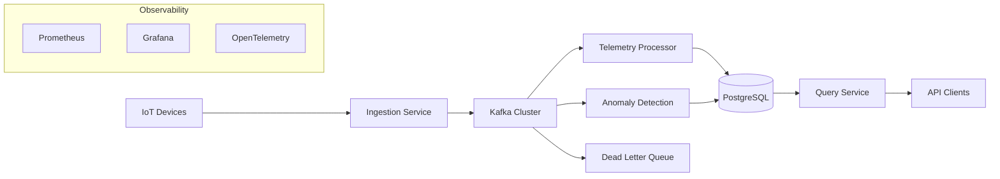

# PulseStream


A cloud-native distributed event processing platform for **IoT telemetry ingestion, streaming analytics, and anomaly detection**.

PulseStream demonstrates how to build a **modern event-driven system** using Kafka, Spring Boot, and Kubernetes.

The project focuses on:

*   Event-driven architecture
*   Distributed systems design
*   Scalable data pipelines
*   Observability and resilience
*   Cloud-native infrastructure

---

## System Architecture

The PulseStream platform is built around an event-driven streaming pipeline powered by Apache Kafka.



Detailed architecture documentation:
`docs/architecture`
`docs/diagrams`

## Where to Start

If you're exploring the project for the first time:

1.  Read the **Platform Overview**
    `docs/platform-overview.md`

2.  Review the **System Architecture**
    `docs/architecture/system-overview.md`

3.  Explore **Architecture Decisions**
    `docs/decisions/`

4.  Check the **Development Roadmap**
    `docs/roadmap.md`


# Architecture Overview

PulseStream is built around an **event streaming backbone powered by Apache Kafka**.

Telemetry events are ingested, streamed through processing services, and persisted for querying and analysis.

High-level architecture:

```bash
IoT Devices
│
▼
Ingestion Service
│
▼
Kafka Cluster
│
├── Telemetry Processor
│ │
│ ▼
│ PostgreSQL
│
└── Anomaly Detection
│
▼
Anomaly Events
```

The system is designed to support:

*   High-throughput telemetry ingestion
*   Decoupled event processing
*   Scalable consumer pipelines
*   Real-time anomaly detection

Detailed diagrams are available in:

```bash
docs/diagrams/
```

---

# Core Technologies

PulseStream is built using the following technologies:

| Technology    | Purpose                       |
|---------------|-------------------------------|
| Apache Kafka  | Event streaming backbone      |
| Spring Boot   | Backend service framework     |
| PostgreSQL    | Telemetry and anomaly storage |
| Redis         | Caching layer                 |
| Prometheus    | Metrics collection            |
| Grafana       | Monitoring dashboards         |
| Docker        | Local development environment |
| Kubernetes    | Production deployment         |

---

# Repository Structure

```bash
docs/
├─ architecture
│ ├─ system-overview.md
│ ├─ services.md
│ └─ event-schema.md
│
├─ diagrams
│ ├─ system-architecture.md
│ ├─ event-flow.md
│ ├─ kafka-topology.md
│ └─ kubernetes-deployment.md
│
├─ decisions
│ ├─ 0001-use-kafka.md
│ ├─ 0002-use-spring-boot.md
│ ├─ 0003-use-postgresql-for-mvp.md
│ └─ 0004-docker-compose-before-kubernetes.md
│
├─ platform-overview.md
└─ roadmap.md
```

---

# Documentation

Start here if you want to understand the system:

| Document                  | Description                                  |
|---------------------------|----------------------------------------------|
| `docs/platform-overview.md` | High-level explanation of the platform       |
| `docs/architecture/`      | System architecture documentation            |
| `docs/diagrams/`          | Architecture diagrams                        |
| `docs/decisions/`         | Architecture Decision Records (ADRs)         |
| `docs/roadmap.md`         | Development roadmap                          |

---

# Development Roadmap

The platform is developed in structured phases.

1.  System Architecture
2.  Local Development Platform
3.  Core Event Pipeline
4.  Observability
5.  Reliability and Resilience
6.  Kubernetes Deployment

See full roadmap:

```bash
docs/roadmap.md
```

---

# Running the Platform (Coming Soon)

The next development phase will introduce a **Docker Compose environment** allowing the full platform to run locally.

This environment will include:

*   Kafka cluster
*   PostgreSQL
*   Redis
*   Observability stack
*   Platform services

---

# Contributing

See:

```bash
CONTRIBUTING.md
```

---

# License

This project is licensed under the MIT License.
