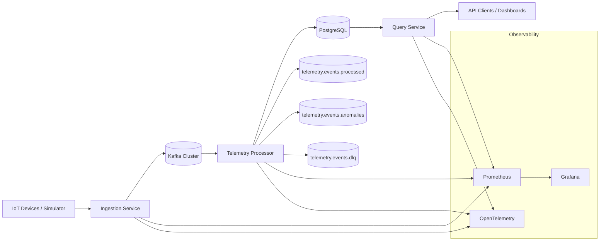

# PulseStream


PulseStream is a cloud-native distributed event processing platform designed for **IoT telemetry ingestion, streaming analytics, and anomaly detection**. The platform demonstrates the implementation of a modern **event-driven system** by leveraging a robust technology stack including Kafka, Spring Boot, Docker, PostgreSQL, Redis, Prometheus, Grafana, and Kubernetes.

The project is engineered with a primary focus on several critical domains of modern software development:
*   **Event-driven architecture** for decoupled and scalable service interaction.
*   **Distributed systems design** to ensure high availability and fault tolerance.
*   **Scalable data pipelines** capable of handling high-velocity telemetry streams.
*   **Observability and resilience** through integrated monitoring and tracing.
*   **Cloud-native infrastructure** for seamless deployment and orchestration.

---

## System Architecture

The PulseStream platform is architected around an event-driven streaming pipeline, with Apache Kafka serving as the central communication backbone. This design allows for asynchronous processing and ensures that the system can scale horizontally to meet increasing data demands.



Comprehensive documentation regarding the system's architecture and visual representations can be found in the following directories:
*   [Architecture Documentation](./docs/architecture/)
*   [Architecture Diagrams](./docs/diagrams/)

---

## Getting Started

For users and developers exploring the project for the first time, the following resources provide a structured introduction to the platform's design and objectives:

| Resource | Description | Path |
| :--- | :--- | :--- |
| **Platform Overview** | A high-level introduction to the PulseStream platform. | [docs/platform-overview.md](./docs/platform-overview.md) |
| **System Architecture** | Detailed technical overview of the system's components. | [docs/architecture/system-overview.md](./docs/architecture/system-overview.md) |
| **Architecture Decisions** | Records of key design choices and their rationales. | [docs/decisions/](./docs/decisions/) |
| **Development Roadmap** | Current progress and future milestones for the project. | [docs/roadmap.md](./docs/roadmap.md) |

---

## Core Technologies

The platform utilizes a curated selection of industry-standard technologies to achieve its architectural goals:

| Technology | Purpose |
| :--- | :--- |
| **Apache Kafka** | Serves as the event streaming backbone for the entire platform. |
| **Spring Boot** | Provides the framework for building robust backend microservices. |
| **PostgreSQL** | Used for persistent storage of telemetry data and anomaly records. |
| **Redis** | Implemented for caching and planned rate-limiting capabilities. |
| **Prometheus** | Handles the collection of system and application metrics. |
| **Grafana** | Provides powerful visualization for monitoring dashboards. |
| **Docker** | Facilitates a consistent local development environment. |
| **Kubernetes** | Used for container orchestration in production deployments. |

---

## Repository Structure

The repository is organized to maintain a clear separation between documentation, infrastructure, and source code:

```text
docs/
├─ architecture/
│  ├─ c4-model.md
│  ├─ cache-strategy.md
│  ├─ event-schema.md
│  ├─ services.md
│  ├─ system-overview.md
│  └─ topics.md
│
├─ diagrams/
│  ├─ system-architecture.md
│  ├─ event-flow.md
│  ├─ kafka-topology.md
│  └─ kubernetes-deployment.md
│
├─ decisions/
│  ├─ 0001-use-kafka.md
│  ├─ 0002-use-spring-boot.md
│  ├─ 0003-use-postgresql-for-mvp.md
│  └─ 0004-docker-compose-before-kubernetes.md
│
├─ platform-overview.md
└─ roadmap.md

infrastructure/
└─ docker/
```

---

## Documentation Index

The following table provides a quick reference to the primary documentation available within the repository:

| Document | Description |
| :--- | :--- |
| [docs/platform-overview.md](./docs/platform-overview.md) | High-level explanation of the platform's purpose and scope. |
| [docs/architecture/](./docs/architecture/) | Detailed documentation of the system's internal architecture. |
| [docs/diagrams/](./docs/diagrams/) | Visual representations of the platform's various components. |
| [docs/decisions/](./docs/decisions/) | Architecture Decision Records (ADRs) detailing key design choices. |
| [docs/roadmap.md](./docs/roadmap.md) | Outline of the project's development phases and future goals. |

---

## Development Roadmap

The PulseStream platform is being developed through a series of structured phases to ensure a robust and scalable implementation:

1.  **System Architecture Definition**
2.  **Local Development Platform Setup**
3.  **Core Event Pipeline Implementation**
4.  **Observability Integration**
5.  **Reliability and Resilience Enhancements**
6.  **Kubernetes Deployment Orchestration**

For a more detailed breakdown of these phases, please refer to the [full roadmap](./docs/roadmap.md).

---

## Running the Platform

The local development environment is currently being finalized. Configuration files and instructions for running the platform locally can be found in the infrastructure directory:
*   [infrastructure/docker/docker-compose.yml](./infrastructure/docker/docker-compose.yml)
*   [infrastructure/docker/README.md](./infrastructure/docker/README.md)

The local environment includes pre-configured instances of **Kafka**, **Zookeeper**, **PostgreSQL**, **Redis**, **Prometheus**, and **Grafana**.

---

## Contributing

We welcome contributions to the PulseStream project. Please review our [CONTRIBUTING.md](./CONTRIBUTING.md) for guidelines on how to get involved.

---

## License

This project is licensed under the **MIT License**.
