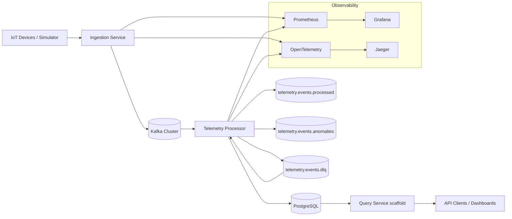

# PulseStream


PulseStream is a cloud-native distributed event processing platform designed for **IoT telemetry ingestion, streaming analytics, and anomaly detection**. The current implementation provides a Spring Boot ingestion service, a Spring Boot telemetry processor, Kafka-based event transport, PostgreSQL persistence for processed telemetry, dead-letter and replay handling, distributed tracing via OpenTelemetry, a Prometheus/Grafana observability stack, and Kubernetes manifests for the full platform. A `query-service` scaffold exists; query APIs, anomaly persistence, and simulator tooling are the primary remaining gaps addressed in Phase 7.

> **Project status.** The platform is at the start of **Phase 7 — Production Readiness and Platform Hardening**; Phases 1 through 6 are complete. The authoritative, up-to-date status is maintained in [PROJECT_STATE.md](./PROJECT_STATE.md).

The project is engineered with a primary focus on several critical domains of modern software development:
*   **Event-driven architecture** for decoupled and scalable service interaction.
*   **Distributed systems design** to ensure high availability and fault tolerance.
*   **Scalable data pipelines** capable of handling high-velocity telemetry streams.
*   **Observability and resilience** through metrics, health endpoints, distributed tracing, dead-letter routing, and event replay.
*   **Cloud-native infrastructure** through Docker Compose for local development and committed Kubernetes manifests for cluster deployment.

---

## System Architecture

The PulseStream platform is architected around an event-driven streaming pipeline, with Apache Kafka serving as the central communication backbone. This design allows for asynchronous processing and ensures that the system can scale horizontally to meet increasing data demands.


```mermaid
flowchart LR
    A[IoT Devices / Simulator] --> B[Ingestion Service]
    B --> C[(Kafka Cluster)]

    C --> D[Telemetry Processor]
    D --> E[(PostgreSQL)]
    E --> F[Query Service scaffold]
    F --> G[API Clients / Dashboards]

    D --> H[(telemetry.events.processed)]
    D --> I[(telemetry.events.anomalies)]
    D --> J[(telemetry.events.dlq)]
    J --> D

    subgraph Observability
        K[Prometheus]
        L[Grafana]
        M[OpenTelemetry]
        N[Jaeger]
    end

    B --> K
    D --> K

    B --> M
    D --> M

    K --> L
    M --> N
```

The dead-letter topic (`telemetry.events.dlq`) captures failed events; a management endpoint on the telemetry processor replays them back into the pipeline. The `query-service` is a deployable scaffold — its REST query logic is Phase 7 work.

Comprehensive documentation regarding the system's architecture and visual representations can be found in the following directories:
*   [Architecture Documentation](./docs/architecture/)
*   [Architecture Diagrams](./docs/diagrams/)

---

## Getting Started

For users and developers exploring the project for the first time, the following resources provide a structured introduction to the platform's design and objectives:

| Resource | Description | Path |
| :--- | :--- | :--- |
| **Platform Overview** | A high-level introduction to the PulseStream platform. | [docs/platform-overview.md](./docs/platform-overview.md) |
| **System Architecture** | Detailed technical overview of the system's components. | [docs/architecture/system-overview.md](./docs/architecture/system-overview.md) |
| **Architecture Decisions** | Records of key design choices and their rationales. | [docs/decisions/](./docs/decisions/) |
| **Development Roadmap** | Current progress and future milestones for the project. | [docs/roadmap.md](./docs/roadmap.md) |

---

## Core Technologies

The platform utilizes a curated selection of industry-standard technologies to achieve its architectural goals:

| Technology | Purpose |
| :--- | :--- |
| **Apache Kafka** | Serves as the event streaming backbone for the entire platform. |
| **Spring Boot** | Provides the framework for building robust backend microservices. |
| **PostgreSQL** | Used for persistent storage of processed telemetry records. |
| **Redis** | Provisioned locally for future caching and rate-limiting capabilities. |
| **Prometheus** | Collects metrics from configured scrape targets. |
| **Grafana** | Version-controlled dashboards, provisioned locally and deployed in-cluster. |
| **OpenTelemetry** | Instrumentation for distributed tracing, exporting OTLP traces. |
| **Jaeger** | Local distributed tracing backend for collecting and visualizing OpenTelemetry traces. |
| **Docker** | Facilitates a consistent local development environment. |
| **Kubernetes** | Cluster deployment target; manifests for all workloads are committed under `infrastructure/kubernetes/`. |

---

## Repository Structure

The repository is organized to maintain a clear separation between documentation, infrastructure, and source code:

```text
docs/
├─ architecture/          # system overview, services, event schema, topics,
│                         # C4 model, autoscaling, container/registry standards, replay
├─ diagrams/              # system architecture, event flow, Kafka topology, Kubernetes deployment
├─ decisions/             # ADRs 0001–0005
├─ platform-overview.md
└─ roadmap.md

infrastructure/
├─ docker/                # local Docker Compose stack
└─ kubernetes/            # committed manifests for all workloads (services, Kafka/Strimzi,
                          # monitoring, observability, autoscaling, network policies)

observability/
└─ grafana/dashboards/    # version-controlled Grafana dashboard definitions

services/
├─ ingestion-service/     # REST ingest gateway
├─ telemetry-processor/   # stream processor, anomaly detection, DLQ + replay
└─ query-service/         # deployable scaffold (query APIs are Phase 7 work)
```

---

## Documentation Index

The following table provides a quick reference to the primary documentation available within the repository:

| Document | Description |
| :--- | :--- |
| [docs/platform-overview.md](./docs/platform-overview.md) | High-level explanation of the platform's purpose and scope. |
| [docs/architecture/](./docs/architecture/) | Detailed documentation of the system's internal architecture. |
| [docs/diagrams/](./docs/diagrams/) | Visual representations of the platform's various components. |
| [docs/decisions/](./docs/decisions/) | Architecture Decision Records (ADRs) detailing key design choices. |
| [docs/roadmap.md](./docs/roadmap.md) | Outline of the project's development phases and future goals. |

---

## Development Roadmap

The PulseStream platform is being developed through a series of structured phases to ensure a robust and scalable implementation:

1.  **System Architecture Definition** — ✅ Complete
2.  **Local Development Platform Setup** — ✅ Complete
3.  **Core Event Pipeline Implementation** — ✅ Complete
4.  **Observability Integration** — ✅ Complete
5.  **Reliability and Resilience Enhancements** — ✅ Complete
6.  **Kubernetes Deployment Orchestration** — ✅ Complete
7.  **Production Readiness and Platform Hardening** — 🚧 In Progress

For a more detailed breakdown of these phases, please refer to the [full roadmap](./docs/roadmap.md). Current status is tracked in [PROJECT_STATE.md](./PROJECT_STATE.md).

---

## Running the Platform

The local development environment is defined with Docker Compose. Configuration files and instructions for running the platform locally can be found in the infrastructure directory:
*   [infrastructure/docker/docker-compose.yml](./infrastructure/docker/docker-compose.yml)
*   [infrastructure/docker/README.md](./infrastructure/docker/README.md)

The local environment includes pre-configured instances of **Kafka**, **Zookeeper**, **PostgreSQL**, **Redis**, **Prometheus**, **Grafana**, and **Jaeger**.

---

## Contributing

We welcome contributions to the PulseStream project. Please review our [CONTRIBUTING.md](./CONTRIBUTING.md) for guidelines on how to get involved.

---

## License

This project is licensed under the **MIT License**.
