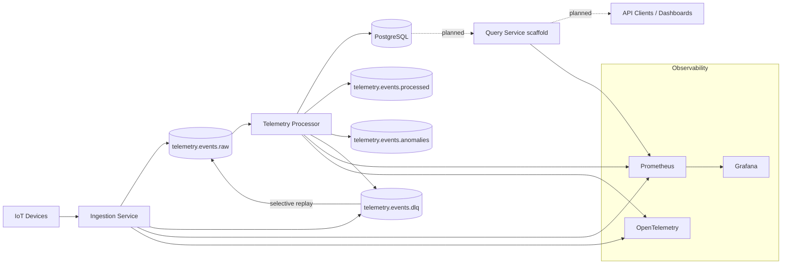

# PulseStream


PulseStream is a cloud-native distributed event processing platform for **IoT telemetry ingestion, streaming analytics, and anomaly detection**.

The platform runs today as three Spring Boot services over a Kafka backbone, deployable both to a Docker Compose development stack and to Kubernetes. Telemetry is ingested over HTTP, transported through Kafka, normalized, checked for anomalies, and persisted to PostgreSQL. Failed events are routed to a dead-letter topic and can be selectively replayed by an operator. Ingestion and processing are instrumented with OpenTelemetry and export traces over OTLP.

The read side is not built yet: anomalies are published as events but not persisted, and `query-service` exists only as a scaffold. See [Current Capabilities](#current-capabilities) for the exact boundary, and [PROJECT_STATE.md](./PROJECT_STATE.md) — the authoritative status document — for detail.

The project is engineered with a primary focus on several critical domains of modern software development:
*   **Event-driven architecture** for decoupled and scalable service interaction.
*   **Distributed systems design** to ensure high availability and fault tolerance.
*   **Scalable data pipelines** capable of handling high-velocity telemetry streams.
*   **Observability and resilience** through metrics, health endpoints, distributed tracing, and dead-letter replay.
*   **Cloud-native infrastructure** through Docker Compose for development and Kubernetes for deployment.

---

## Project Status

[**PROJECT_STATE.md**](./PROJECT_STATE.md) is the authoritative source for the current status of the platform. Where any document in this repository disagrees with it, `PROJECT_STATE.md` is correct.

The platform is in **Phase 7 — Production Readiness and Platform Hardening** ([#254](https://github.com/ME-Massine/pulsestream/issues/254)). Phases 1 through 5 are complete. Phase 6 delivered the Kubernetes deployment; its in-cluster observability stack and autoscaling validation remain open and are tracked explicitly in `PROJECT_STATE.md`.

Documentation in this repository uses three status words consistently — **Planned**, **Implemented**, and **Validated** — defined in [PROJECT_STATE.md](./PROJECT_STATE.md#how-to-read-status-in-this-repository). Validation is always environment-specific: a capability validated under Docker Compose is not thereby validated on Kubernetes.

---

## Current Capabilities

| Capability | Status |
| :--- | :--- |
| Telemetry ingestion API (`POST /api/v1/events`) with schema validation | Implemented |
| Kafka transport across `raw`, `processed`, `anomalies` and `dlq` topics | Implemented |
| Telemetry normalization and threshold-based anomaly detection | Implemented |
| PostgreSQL persistence of normal processed telemetry | Implemented |
| Dead-letter routing from both ingestion and processing failures | Validated under Docker Compose |
| Bounded, operator-selected dead-letter replay | Validated under Docker Compose |
| Distributed tracing (OpenTelemetry, OTLP, W3C context propagation) | Validated under Docker Compose |
| Prometheus metrics and actuator health endpoints in all services | Implemented |
| Kubernetes deployment: services, Strimzi Kafka, ClusterIP/NodePort, NetworkPolicies, HPAs, OTel Collector | Validated on a live cluster |

### Current Limitations

*   **Anomalies are not persisted.** They are published to `telemetry.events.anomalies`; the `platform.anomalies` table exists in the schema script but no application code writes to it ([#267](https://github.com/ME-Massine/pulsestream/issues/267)).
*   **`query-service` is a scaffold.** It has a Dockerfile, actuator endpoints and Kubernetes manifests, but no controllers, no data access, and no query endpoints ([#266](https://github.com/ME-Massine/pulsestream/issues/266)).
*   **No trace backend runs in Kubernetes.** The in-cluster collector receives spans and terminates them in its `debug` exporter; Jaeger runs under Docker Compose only ([#158](https://github.com/ME-Massine/pulsestream/issues/158)).
*   **Prometheus and Grafana are not deployed in Kubernetes** ([#154](https://github.com/ME-Massine/pulsestream/issues/154), [#155](https://github.com/ME-Massine/pulsestream/issues/155)).
*   **No PostgreSQL manifest is committed.** The service ConfigMaps address `postgres:5432`, which must be provisioned out of band for in-cluster persistence to work.
*   **Ingestion is unauthenticated and unencrypted**, and Kafka client traffic is neither authenticated nor encrypted ([#273](https://github.com/ME-Massine/pulsestream/issues/273), [#275](https://github.com/ME-Massine/pulsestream/issues/275)).
*   **The schema is applied by an init script**, not by versioned migrations ([#265](https://github.com/ME-Massine/pulsestream/issues/265)).
*   **No device simulator exists**, and Redis is provisioned but unused by application code.

---

## System Architecture

The PulseStream platform is architected around an event-driven streaming pipeline, with Apache Kafka serving as the central communication backbone. This design allows for asynchronous processing and ensures that the system can scale horizontally to meet increasing data demands.


```mermaid
flowchart LR
    A[IoT Devices] --> B[Ingestion Service]
    B --> C[(telemetry.events.raw)]

    C --> D[Telemetry Processor]
    D --> E[(PostgreSQL)]
    E -.planned.-> F[Query Service scaffold]
    F -.planned.-> G[API Clients / Dashboards]

    D --> H[(telemetry.events.processed)]
    D --> I[(telemetry.events.anomalies)]
    B --> J[(telemetry.events.dlq)]
    D --> J
    J -->|selective replay| C

    subgraph Observability
        K[Prometheus]
        L[Grafana]
        M[OpenTelemetry]
    end

    B --> K
    D --> K
    F --> K

    B --> M
    D --> M

    K --> L
```

Dashed edges are planned. `query-service` exports metrics but emits no traces and serves no query endpoints.

Comprehensive documentation regarding the system's architecture and visual representations can be found in the following directories:
*   [Architecture Documentation](./docs/architecture/)
*   [Architecture Diagrams](./docs/diagrams/)

---

## Getting Started

For users and developers exploring the project for the first time, the following resources provide a structured introduction to the platform's design and objectives:

| Resource | Description | Path |
| :--- | :--- | :--- |
| **Project State** | Authoritative record of what is built, validated, and outstanding. | [PROJECT_STATE.md](./PROJECT_STATE.md) |
| **Platform Overview** | A high-level introduction to the PulseStream platform. | [docs/platform-overview.md](./docs/platform-overview.md) |
| **System Architecture** | Detailed technical overview of the system's components. | [docs/architecture/system-overview.md](./docs/architecture/system-overview.md) |
| **Architecture Decisions** | Records of key design choices and their rationales. | [docs/decisions/](./docs/decisions/) |
| **Development Roadmap** | Phase-by-phase plan and its current progress. | [docs/roadmap.md](./docs/roadmap.md) |

---

## Core Technologies

The platform utilizes a curated selection of industry-standard technologies to achieve its architectural goals:

| Technology | Purpose |
| :--- | :--- |
| **Apache Kafka** | Serves as the event streaming backbone for the entire platform. Runs under Docker Compose locally and under the Strimzi operator in KRaft mode on Kubernetes. |
| **Spring Boot** | Provides the framework for building the platform microservices. |
| **PostgreSQL** | Persistent storage of processed telemetry records. |
| **Redis** | Provisioned locally for future caching and rate limiting; unused by application code today. |
| **Prometheus** | Scrapes service metrics in the local development stack. |
| **Grafana** | Provisioned locally with a Prometheus datasource. |
| **OpenTelemetry** | Instruments the ingestion and processing services; exports OTLP to Jaeger locally and to a collector in Kubernetes. |
| **Jaeger** | Trace backend in the local development stack. |
| **Docker** | Containerizes the services and provides a consistent local environment. |
| **Kubernetes** | Deployment target. Manifests for services, Kafka, networking, and autoscaling are committed and applied. |

---

## Repository Structure

The repository is organized to maintain a clear separation between documentation, infrastructure, and source code:

```text
docs/
├─ architecture/
│  ├─ autoscaling-strategy.md
│  ├─ c4-model.md
│  ├─ cache-strategy.md
│  ├─ container-build-standard.md
│  ├─ container-image-registry.md
│  ├─ container-image-validation.md
│  ├─ custom-metrics-autoscaling.md
│  ├─ event-replay-strategy.md
│  ├─ event-schema.md
│  ├─ services.md
│  ├─ system-overview.md
│  └─ topics.md
│
├─ diagrams/
│  ├─ system-architecture.md
│  ├─ event-flow.md
│  ├─ kafka-topology.md
│  └─ kubernetes-deployment.md
│
├─ decisions/
│  ├─ 0001-use-kafka.md
│  ├─ 0002-use-spring-boot.md
│  ├─ 0003-use-postgresql-for-mvp.md
│  ├─ 0004-docker-compose-before-kubernetes.md
│  └─ 0005-kafka-on-kubernetes-with-strimzi.md
│
├─ platform-overview.md
└─ roadmap.md

infrastructure/
├─ docker/          Docker Compose local platform
└─ kubernetes/      Service, Kafka, networking, autoscaling and collector manifests

scripts/            Validation procedures and their structural tests

services/
├─ ingestion-service
├─ telemetry-processor
└─ query-service    (scaffold)
```

---

## Documentation Index

The following table provides a quick reference to the primary documentation available within the repository:

| Document | Description |
| :--- | :--- |
| [PROJECT_STATE.md](./PROJECT_STATE.md) | Authoritative status of the platform, its gaps, and the issue hierarchy. |
| [docs/platform-overview.md](./docs/platform-overview.md) | High-level explanation of the platform's purpose and scope. |
| [docs/architecture/](./docs/architecture/) | Detailed documentation of the system's internal architecture. |
| [docs/diagrams/](./docs/diagrams/) | Visual representations of the platform's various components. |
| [docs/decisions/](./docs/decisions/) | Architecture Decision Records (ADRs) detailing key design choices. |
| [docs/roadmap.md](./docs/roadmap.md) | Outline of the project's development phases and future goals. |
| [infrastructure/kubernetes/](./infrastructure/kubernetes/) | Manifests, each directory with its own `README.md` covering apply order and verification. |

---

## Development Roadmap

The PulseStream platform is being developed through a series of structured phases:

1.  **System Architecture Definition** — complete
2.  **Local Development Platform Setup** — complete
3.  **Core Event Pipeline Implementation** — complete
4.  **Observability Integration** — complete under Docker Compose
5.  **Reliability and Resilience Enhancements** — complete
6.  **Kubernetes Deployment Orchestration** — in progress
7.  **Production Readiness and Platform Hardening** — in progress, current phase

For a more detailed breakdown of these phases, please refer to the [full roadmap](./docs/roadmap.md).

---

## Running the Platform

### Local development

The local development environment is defined with Docker Compose:
*   [infrastructure/docker/docker-compose.yml](./infrastructure/docker/docker-compose.yml)
*   [infrastructure/docker/README.md](./infrastructure/docker/README.md)

The local environment includes pre-configured instances of **Kafka**, **Zookeeper**, **PostgreSQL**, **Redis**, **Prometheus**, **Grafana**, and **Jaeger**. The Spring Boot services run from their own directories on the host against that infrastructure.

### Kubernetes

Manifests live under [infrastructure/kubernetes/](./infrastructure/kubernetes/). Each directory carries a `README.md` with its apply order, prerequisites, and verification steps — read those first rather than applying the tree wholesale, since some directories contain example Secrets that must not be applied. A PostgreSQL Service reachable at `postgres:5432` must be provisioned out of band.

---

## Contributing

We welcome contributions to the PulseStream project. Please review our [CONTRIBUTING.md](./CONTRIBUTING.md) for guidelines on how to get involved.

---

## License

This project is licensed under the **MIT License**.
