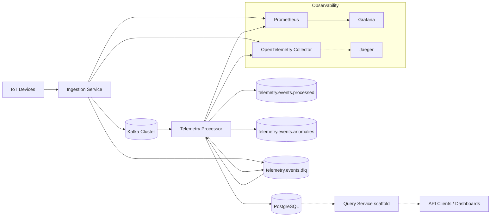

# PulseStream


PulseStream is a cloud-native distributed event processing platform designed for **IoT telemetry ingestion, streaming analytics, and anomaly detection**.

The platform ingests telemetry over HTTP, transports it through Kafka, normalizes it, detects anomalies, and persists processed telemetry to PostgreSQL. Failed events are routed to a dead-letter queue and can be selectively replayed by an operator. Both event-path services are instrumented for distributed tracing and expose Prometheus metrics. The whole platform deploys to Kubernetes with Strimzi-managed Kafka, NetworkPolicies, and horizontal pod autoscaling, and runs locally on Docker Compose.

The read side is the main gap: `query-service` is a scaffold with no endpoints, and detected anomalies are published to Kafka but not yet persisted. Both are Phase 7 work.

The project is engineered with a primary focus on several critical domains of modern software development:
*   **Event-driven architecture** for decoupled and scalable service interaction.
*   **Distributed systems design** to ensure high availability and fault tolerance.
*   **Scalable data pipelines** capable of handling high-velocity telemetry streams.
*   **Observability and resilience** through metrics, distributed tracing, health probes, and dead-letter replay.
*   **Cloud-native infrastructure** through Docker Compose locally and Kubernetes for deployment.

---

## Platform Status

[`PROJECT_STATE.md`](./PROJECT_STATE.md) is the **authoritative record of the current engineering state**. If any document in this repository disagrees with it, that document is the defect.

Capability statements across the documentation use three words with fixed meanings — **implemented** (committed to this repository), **validated** (implemented *and* exercised end to end against a running platform, with linked evidence), and **planned** (not implemented, issue linked). The definitions live in [`PROJECT_STATE.md`](./PROJECT_STATE.md#status-vocabulary).

| Area | Status |
| :--- | :--- |
| Telemetry ingestion API, Kafka transport, normalization, anomaly detection | Implemented |
| PostgreSQL persistence of processed telemetry | Implemented |
| Dead-letter routing and operator-triggered selective replay | Validated |
| Prometheus metrics, Grafana dashboards, distributed tracing to Jaeger | Validated on the local stack |
| Kubernetes deployment, Strimzi Kafka, NetworkPolicies, autoscaling | Validated |
| Query APIs and anomaly persistence | Planned — Phase 7 |
| In-cluster Prometheus, Grafana, and tracing backend | Planned — Phase 6 carry-over |
| TLS and authentication on external ingestion; secured Kafka clients | Planned — Phase 7 |

---

## System Architecture

The PulseStream platform is architected around an event-driven streaming pipeline, with Apache Kafka serving as the central communication backbone. This design allows for asynchronous processing and ensures that the system can scale horizontally to meet increasing data demands.


```mermaid
flowchart LR
    A[IoT Devices] --> B[Ingestion Service]
    B --> C[(Kafka Cluster)]

    C --> D[Telemetry Processor]
    D --> E[(PostgreSQL)]
    E -.-> F[Query Service scaffold]
    F -.-> G[API Clients / Dashboards]

    D --> H[(telemetry.events.processed)]
    D --> I[(telemetry.events.anomalies)]
    B --> J[(telemetry.events.dlq)]
    D --> J
    J --> D

    subgraph Observability
        K[Prometheus]
        L[Grafana]
        M[OpenTelemetry Collector]
        N[Jaeger]
    end

    B --> K
    D --> K

    B --> M
    D --> M

    K --> L
    M -.-> N
```

Solid edges are implemented paths. Dashed edges are not yet in place: `query-service` has no data access or endpoints, and the OpenTelemetry Collector forwards to Jaeger locally but terminates in a `debug` exporter in Kubernetes until a tracing backend is deployed.

Comprehensive documentation regarding the system's architecture and visual representations can be found in the following directories:
*   [Architecture Documentation](./docs/architecture/)
*   [Architecture Diagrams](./docs/diagrams/)

---

## Getting Started

For users and developers exploring the project for the first time, the following resources provide a structured introduction to the platform's design and objectives:

| Resource | Description | Path |
| :--- | :--- | :--- |
| **Project State** | Authoritative record of what is implemented, validated, and planned. | [PROJECT_STATE.md](./PROJECT_STATE.md) |
| **Platform Overview** | A high-level introduction to the PulseStream platform. | [docs/platform-overview.md](./docs/platform-overview.md) |
| **System Architecture** | Detailed technical overview of the system's components. | [docs/architecture/system-overview.md](./docs/architecture/system-overview.md) |
| **Architecture Decisions** | Records of key design choices and their rationales. | [docs/decisions/](./docs/decisions/) |
| **Development Roadmap** | Current progress and future milestones for the project. | [docs/roadmap.md](./docs/roadmap.md) |

---

## Core Technologies

The platform utilizes a curated selection of industry-standard technologies to achieve its architectural goals:

| Technology | Purpose |
| :--- | :--- |
| **Apache Kafka** | Event streaming backbone. Strimzi-managed in KRaft mode on Kubernetes. |
| **Spring Boot** | Framework for the platform microservices. |
| **PostgreSQL** | Persistent storage of processed telemetry records. |
| **Redis** | Provisioned locally for future caching and rate limiting; no service consumes it yet. |
| **Prometheus** | Metrics collection from service actuator endpoints. |
| **Grafana** | Dashboards provisioned from version-controlled JSON in `observability/`. |
| **OpenTelemetry** | Trace instrumentation in both event-path services, plus a collector deployment. |
| **Jaeger** | Local distributed tracing backend for collecting and visualizing traces. |
| **Docker** | Containerization and the local development environment. |
| **Kubernetes** | Deployment target, with manifests for all services, Kafka, autoscaling, and network isolation. |

---

## Repository Structure

The repository is organized to maintain a clear separation between documentation, infrastructure, and source code:

```text
docs/
├─ architecture/          system overview, C4 model, services, topics, event schema,
│                         event replay, autoscaling, and container build standards
├─ decisions/             architecture decision records (ADR 0001–0005)
├─ diagrams/              system architecture, event flow, Kafka topology, Kubernetes deployment
├─ platform-overview.md
└─ roadmap.md

infrastructure/
├─ docker/                local Docker Compose stack, Kafka/Postgres/Grafana provisioning
└─ kubernetes/            deployments, services, Strimzi Kafka, HPAs, NetworkPolicies,
                          OpenTelemetry Collector

observability/
└─ grafana/dashboards/    version-controlled dashboard JSON

scripts/                  PowerShell validation and helper scripts, plus their offline tests

services/
├─ ingestion-service/     telemetry HTTP API and Kafka producer
├─ query-service/         scaffold; no endpoints yet
└─ telemetry-processor/   normalization, anomaly detection, persistence, DLQ replay
```

---

## Documentation Index

The following table provides a quick reference to the primary documentation available within the repository:

| Document | Description |
| :--- | :--- |
| [PROJECT_STATE.md](./PROJECT_STATE.md) | Authoritative current engineering state, capabilities, and known gaps. |
| [docs/platform-overview.md](./docs/platform-overview.md) | High-level explanation of the platform's purpose and scope. |
| [docs/architecture/](./docs/architecture/) | Detailed documentation of the system's internal architecture. |
| [docs/diagrams/](./docs/diagrams/) | Visual representations of the platform's various components. |
| [docs/decisions/](./docs/decisions/) | Architecture Decision Records (ADRs) detailing key design choices. |
| [docs/roadmap.md](./docs/roadmap.md) | Outline of the project's development phases and future goals. |

---

## Development Roadmap

The PulseStream platform is developed through a series of structured phases:

1.  **System Architecture Definition** — complete
2.  **Local Development Platform Setup** — complete
3.  **Core Event Pipeline Implementation** — complete for the write path
4.  **Observability Integration** — complete for the local stack
5.  **Reliability and Resilience Enhancements** — complete
6.  **Kubernetes Deployment Orchestration** — complete except the in-cluster observability stack
7.  **Production Readiness and Platform Hardening** — in progress

For a more detailed breakdown of these phases, please refer to the [full roadmap](./docs/roadmap.md).

---

## Running the Platform

### Locally with Docker Compose

The local development environment is defined with Docker Compose. Configuration files and instructions can be found in the infrastructure directory:
*   [infrastructure/docker/docker-compose.yml](./infrastructure/docker/docker-compose.yml)
*   [infrastructure/docker/README.md](./infrastructure/docker/README.md)

The local environment includes pre-configured instances of **Kafka**, **Zookeeper**, **PostgreSQL**, **Redis**, **Prometheus**, **Grafana**, and **Jaeger**. The Spring Boot services are run from their own directories against that infrastructure.

### On Kubernetes

Manifests for the services, Strimzi-managed Kafka, autoscaling, network isolation, and the OpenTelemetry Collector are under [infrastructure/kubernetes/](./infrastructure/kubernetes/). Each subdirectory carries its own README with apply order and verification steps:
*   [infrastructure/kubernetes/kafka/README.md](./infrastructure/kubernetes/kafka/README.md)
*   [infrastructure/kubernetes/network-policies/README.md](./infrastructure/kubernetes/network-policies/README.md)
*   [infrastructure/kubernetes/autoscaling/README.md](./infrastructure/kubernetes/autoscaling/README.md)
*   [infrastructure/kubernetes/observability/README.md](./infrastructure/kubernetes/observability/README.md)
*   [infrastructure/kubernetes/service-discovery.md](./infrastructure/kubernetes/service-discovery.md)

PostgreSQL is not provisioned by these manifests; `telemetry-processor` expects a `postgres:5432` Service in its namespace.

---

## Contributing

We welcome contributions to the PulseStream project. Please review our [CONTRIBUTING.md](./CONTRIBUTING.md) for guidelines on how to get involved.

---

## License

This project is licensed under the **MIT License**.
