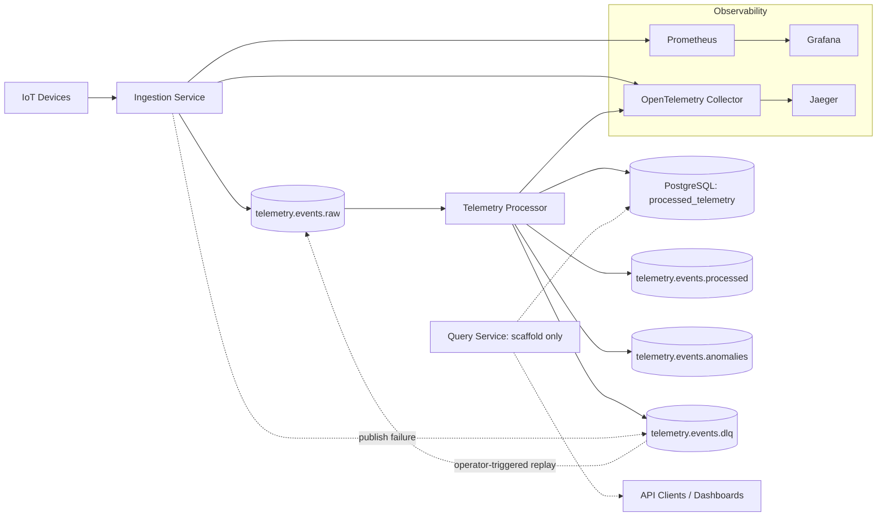

# PulseStream


PulseStream is a cloud-native distributed event processing platform for **IoT telemetry ingestion, streaming analytics, and anomaly detection**.

The platform ingests telemetry over HTTP, transports it through Kafka, normalizes it and detects anomalies, persists processed telemetry to PostgreSQL, routes failures to a dead-letter queue with operator-triggered replay, emits metrics and distributed traces, and deploys to Kubernetes with autoscaling. It is currently in **Phase 7 — Production Readiness and Platform Hardening**.

The project is engineered with a primary focus on several critical domains of modern software development:

*   **Event-driven architecture** for decoupled and scalable service interaction.
*   **Distributed systems design** to ensure high availability and fault tolerance.
*   **Scalable data pipelines** capable of handling high-velocity telemetry streams.
*   **Observability and resilience** through metrics, health endpoints, distributed tracing, and dead-letter replay.
*   **Cloud-native infrastructure** through Docker Compose locally and Kubernetes manifests for cluster deployment.

---

## Project Status

[**PROJECT_STATE.md**](./PROJECT_STATE.md) is the authoritative record of what is built. Where this README, the roadmap, or any architecture document disagrees with it, `PROJECT_STATE.md` is correct.

Documentation across this repository uses three status terms, and they are not interchangeable:

*   **Implemented** — the code or manifests exist here and are covered by tests.
*   **Validated** — implemented, *and* verified end-to-end against a running environment by a named script in [`scripts/`](./scripts/).
*   **Planned** — not present here; tracked by a referenced GitHub issue.

### What the platform does today

| Capability | Status |
| :--- | :--- |
| Telemetry ingestion API (`POST /api/v1/events`) with validation | Implemented |
| Kafka transport across `raw`, `processed`, `anomalies` and `dlq` topics | Implemented |
| Normalization and threshold-based anomaly detection | Implemented |
| Processed telemetry persistence in PostgreSQL | Implemented |
| Dead-letter routing from both ingestion and processing failures | Validated |
| Operator-triggered, selective and bounded DLQ replay | Validated |
| Prometheus metrics and Grafana dashboards for the local stack | Validated |
| Distributed tracing with OpenTelemetry and Jaeger, across the HTTP hop | Validated |
| Kubernetes deployment: services, Strimzi Kafka, networking, NetworkPolicies | Validated |
| Horizontal autoscaling on CPU and on a Prometheus custom metric | Validated |
| In-cluster OpenTelemetry Collector, Prometheus and Grafana | Implemented |

### What it does not do yet

*   **No query API.** `query-service` is a scaffold with actuator endpoints and no business functionality (#266).
*   **No anomaly persistence.** Anomalies are published to Kafka; the `platform.anomalies` table is unused by application code (#267).
*   **No schema migrations** and **no versioned event contracts** (#265, #268).
*   **No authentication** on the ingestion API, and **no encryption** on Kafka traffic (#273, #275).
*   **No PostgreSQL in Kubernetes.** The manifests expect a database supplied out of band.
*   **No device simulator.** Synthetic load comes from the validation scripts.
*   Traces stop at the HTTP boundary — Kafka producer spans are missing (#294) — and consumer lag is not exported as a metric (#272).

The complete list, with the reasoning behind each gap, is in [PROJECT_STATE.md](./PROJECT_STATE.md#known-gaps-and-limitations).

---

## System Architecture

The platform is architected around an event-driven streaming pipeline, with Apache Kafka serving as the central communication backbone. This design allows for asynchronous processing and ensures that the system can scale horizontally to meet increasing data demands.


```mermaid
flowchart LR
    A[IoT Devices] --> B[Ingestion Service]
    B --> C[(telemetry.events.raw)]

    C --> D[Telemetry Processor]
    D --> E[(PostgreSQL: processed_telemetry)]

    D --> H[(telemetry.events.processed)]
    D --> I[(telemetry.events.anomalies)]
    D --> J[(telemetry.events.dlq)]
    B -. publish failure .-> J
    J -. operator-triggered replay .-> C

    F[Query Service: scaffold only] -.-> E
    F -.-> G[API Clients / Dashboards]

    subgraph Observability
        K[Prometheus]
        L[Grafana]
        M[OpenTelemetry Collector]
        N[Jaeger]
    end

    B --> K
    B --> M
    D --> M
    M --> N
    K --> L
```

Dotted edges are not implemented yet. Comprehensive documentation about the architecture and its diagrams is in:

*   [Architecture Documentation](./docs/architecture/)
*   [Architecture Diagrams](./docs/diagrams/)

---

## Getting Started

| Resource | Description | Path |
| :--- | :--- | :--- |
| **Project State** | Authoritative record of what is implemented, validated and planned. | [PROJECT_STATE.md](./PROJECT_STATE.md) |
| **Platform Overview** | A high-level introduction to the PulseStream platform. | [docs/platform-overview.md](./docs/platform-overview.md) |
| **System Architecture** | Detailed technical overview of the system's components. | [docs/architecture/system-overview.md](./docs/architecture/system-overview.md) |
| **Architecture Decisions** | Records of key design choices and their rationales. | [docs/decisions/](./docs/decisions/) |
| **Development Roadmap** | Phase-by-phase development plan. | [docs/roadmap.md](./docs/roadmap.md) |

---

## Core Technologies

| Technology | Purpose |
| :--- | :--- |
| **Apache Kafka** | Event streaming backbone; deployed in KRaft mode via Strimzi in Kubernetes. |
| **Spring Boot** | Framework for the platform microservices. |
| **PostgreSQL** | Persistent storage of processed telemetry records. |
| **Redis** | Provisioned in the local stack; not yet used by any service. |
| **Prometheus** | Metrics collection, locally and in cluster; also the source for custom-metric autoscaling. |
| **Grafana** | Dashboards; provisioned locally, base deployment in cluster. |
| **OpenTelemetry** | Trace instrumentation and in-cluster collection. |
| **Jaeger** | Trace backend in the local stack. |
| **Docker** | Consistent local development environment and service images. |
| **Kubernetes** | Cluster deployment target: manifests, Strimzi Kafka, NetworkPolicies and autoscaling. |

---

## Repository Structure

```text
docs/
├─ architecture/
│  ├─ autoscaling-strategy.md
│  ├─ autoscaling-validation.md
│  ├─ c4-model.md
│  ├─ cache-strategy.md
│  ├─ container-build-standard.md
│  ├─ container-image-registry.md
│  ├─ container-image-validation.md
│  ├─ custom-metrics-autoscaling.md
│  ├─ event-replay-strategy.md
│  ├─ event-schema.md
│  ├─ services.md
│  ├─ system-overview.md
│  └─ topics.md
│
├─ diagrams/
│  ├─ system-architecture.md
│  ├─ event-flow.md
│  ├─ kafka-topology.md
│  └─ kubernetes-deployment.md
│
├─ decisions/
│  ├─ 0001-use-kafka.md
│  ├─ 0002-use-spring-boot.md
│  ├─ 0003-use-postgresql-for-mvp.md
│  ├─ 0004-docker-compose-before-kubernetes.md
│  └─ 0005-kafka-on-kubernetes-with-strimzi.md
│
├─ platform-overview.md
└─ roadmap.md

infrastructure/
├─ docker/          local Compose platform
└─ kubernetes/      service, Kafka, networking, autoscaling and observability manifests

observability/      Grafana dashboard definitions
scripts/            end-to-end validation scripts and their tests
services/
├─ ingestion-service/
├─ query-service/
└─ telemetry-processor/
```

---

## Documentation Index

| Document | Description |
| :--- | :--- |
| [PROJECT_STATE.md](./PROJECT_STATE.md) | Authoritative status of every platform capability. |
| [docs/platform-overview.md](./docs/platform-overview.md) | High-level explanation of the platform's purpose and scope. |
| [docs/architecture/](./docs/architecture/) | Detailed documentation of the system's internal architecture. |
| [docs/diagrams/](./docs/diagrams/) | Visual representations of the platform's components. |
| [docs/decisions/](./docs/decisions/) | Architecture Decision Records (ADRs) detailing key design choices. |
| [docs/roadmap.md](./docs/roadmap.md) | Development phases and their outcomes. |
| [infrastructure/kubernetes/service-discovery.md](./infrastructure/kubernetes/service-discovery.md) | In-cluster DNS and service discovery conventions. |

---

## Development Roadmap

The platform is developed through structured phases:

1.  **System Architecture Definition** — complete
2.  **Local Development Platform** — complete
3.  **Core Event Pipeline** — complete
4.  **Observability Integration** — complete for the local platform
5.  **Reliability and Resilience** — complete
6.  **Kubernetes Deployment** — in progress
7.  **Production Readiness and Platform Hardening** — current phase

For the detailed breakdown, see the [full roadmap](./docs/roadmap.md); for what each phase actually delivered, see [PROJECT_STATE.md](./PROJECT_STATE.md).

---

## Running the Platform

### Locally with Docker Compose

The local development environment is defined with Docker Compose:

*   [infrastructure/docker/docker-compose.yml](./infrastructure/docker/docker-compose.yml)
*   [infrastructure/docker/README.md](./infrastructure/docker/README.md)

It provides **Kafka**, **Zookeeper**, **PostgreSQL**, **Redis**, **Prometheus**, **Grafana** and **Jaeger**. The Spring Boot services are run from their own directories under `services/` against that infrastructure.

### On Kubernetes

Manifests for the services, Kafka (Strimzi), networking, NetworkPolicies, autoscaling and the observability stack are in [infrastructure/kubernetes/](./infrastructure/kubernetes/), with most component directories carrying a README of apply and verification steps. A PostgreSQL instance is a prerequisite: the platform does not provision one in cluster.

---

## Contributing

Contributions are welcome. Please review [CONTRIBUTING.md](./CONTRIBUTING.md) for guidelines.

---

## License

This project is licensed under the **MIT License**.
