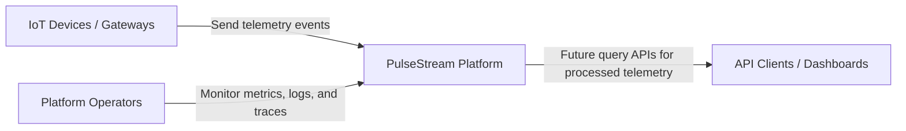
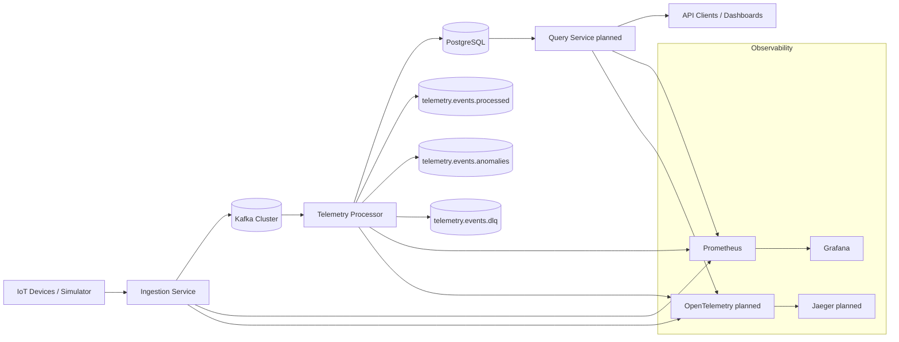
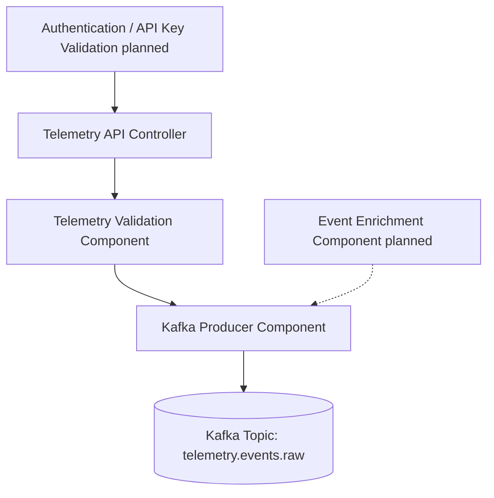
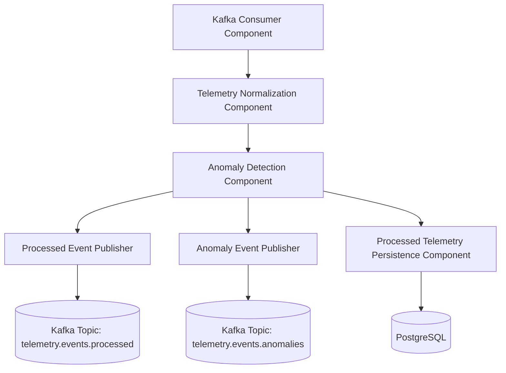

# C4 Model

This document describes the PulseStream platform using the C4 model.

The C4 model presents software architecture through four levels of abstraction:

- Context
- Container
- Component
- Code

For the current stage of PulseStream, this document focuses on the first three levels.

---

# Level 1 — System Context

The System Context view shows how PulseStream interacts with external users and systems.

## Description

PulseStream is a cloud-native platform that ingests IoT telemetry events, processes them through a streaming backbone, detects anomalies, and persists processed telemetry. Query access for downstream clients is planned.

External actors include:

- IoT devices and gateways that send telemetry
- future platform users or API clients that query processed data
- operators who monitor platform health and observability dashboards

## Context Diagram

Notes
- IoT devices and gateways are the primary producers of telemetry events.
- API clients and dashboards consume processed platform data.
- Platform operators use observability tooling to monitor system health.

## Level 2 — Container View

The Container view shows the major deployable/runtime building blocks of the platform.

Description

PulseStream is composed of services and infrastructure that work together to ingest, process, and store telemetry data. Query and tracing containers are planned extensions.

Container Diagram

## Containers

| Container           | Responsibility                                             | Technology                                 |
| ------------------- | ---------------------------------------------------------- | ------------------------------------------ |
| Ingestion Service   | Accept telemetry events and publish them to Kafka          | Spring Boot                                |
| Kafka Cluster       | Event streaming backbone                                   | Apache Kafka                               |
| Telemetry Processor | Consume telemetry events, normalize data, detect anomalies | Spring Boot                                |
| Query Service       | Planned API for processed telemetry and anomaly data       | Spring Boot                                |
| PostgreSQL          | Persist processed telemetry records                        | PostgreSQL                                 |
| Observability Stack | Metrics today; dashboards and tracing planned              | Prometheus, Grafana, OpenTelemetry, Jaeger |
| Device Simulator    | Planned synthetic telemetry traffic generator              | Spring Boot or lightweight simulator       |

Notes
- Kafka is the central asynchronous communication layer.
- Services are loosely coupled and communicate primarily through events.
- PostgreSQL stores processed results, not the full streaming backbone.
- Prometheus and Grafana are provisioned locally; tracing is planned.

## Level 3 — Component View

The Component view zooms into one container and describes its internal parts.

For PulseStream, the most important container to detail first is the Ingestion Service.

Ingestion Service Components

## Ingestion Service Component Responsibilities

| Component                           | Responsibility                                    |
| ----------------------------------- | ------------------------------------------------- |
| Telemetry API Controller            | Accept incoming HTTP telemetry requests           |
| Authentication / API Key Validation | Planned producer identity and access validation   |
| Telemetry Validation Component      | Validate the event schema and required fields     |
| Event Enrichment Component          | Planned metadata enrichment such as timestamps or source details |
| Kafka Producer Component            | Publish validated events to Kafka                 |

Notes
- The ingestion service should remain stateless.
- Business processing should not happen here.
- The ingestion service should validate and forward events, not analyze them.

## Level 3 — Component View (Telemetry Processor)

The Telemetry Processor is the core event-processing service of the platform.

Telemetry Processor Components

## Telemetry Processor Component Responsibilities

| Component                         | Responsibility                                     |
| --------------------------------- | -------------------------------------------------- |
| Kafka Consumer Component          | Consume raw telemetry events from Kafka            |
| Telemetry Normalization Component | Standardize incoming telemetry data                |
| Anomaly Detection Component       | Apply anomaly rules and identify abnormal readings |
| Processed Event Publisher         | Publish normalized telemetry events                |
| Anomaly Event Publisher           | Publish anomaly events                             |
| Processed Telemetry Persistence Component | Store normal processed telemetry records |

Notes

- The processor is the main data-processing engine of the platform.
- Anomaly detection rules should be isolated and extensible.
- Output flows are separated into processed, anomalous, and persistent paths. Anomaly persistence is planned but not implemented in application code yet.

## Level 4 — Code View

The Code view is intentionally kept lightweight. The first services now exist under `services/ingestion-service` and `services/telemetry-processor`.

Expected future additions:

- package/module structure for ingestion service
- package/module structure for telemetry processor
- service-level class diagrams if needed
- source code organization by domain and responsibility

## Summary

The C4 model helps describe PulseStream from multiple perspectives:

- System Context explains how the platform interacts with external actors
- Container View shows the major runtime building blocks
- Component View explains the internal structure of the most important services

This model complements the system overview, service architecture, and diagrams already present in the repository.
