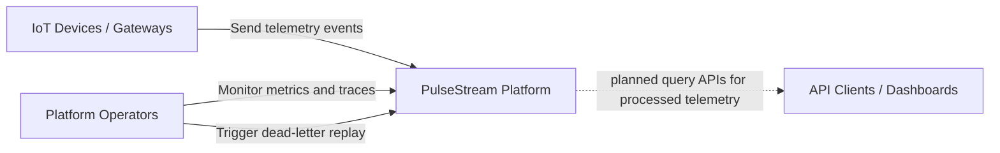
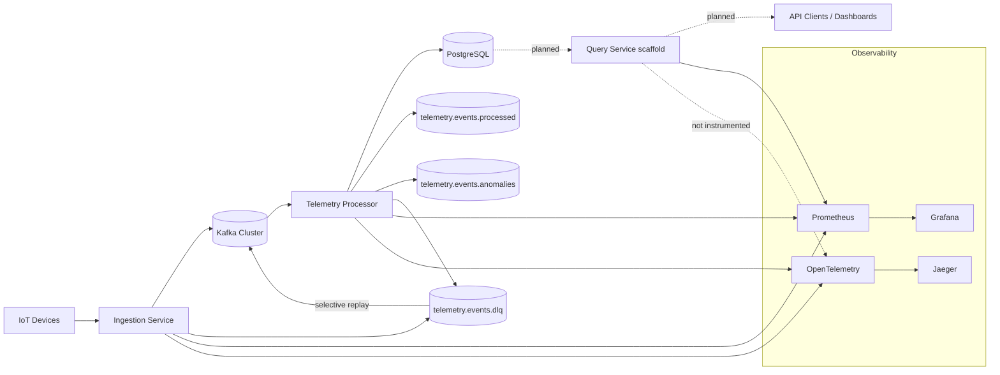
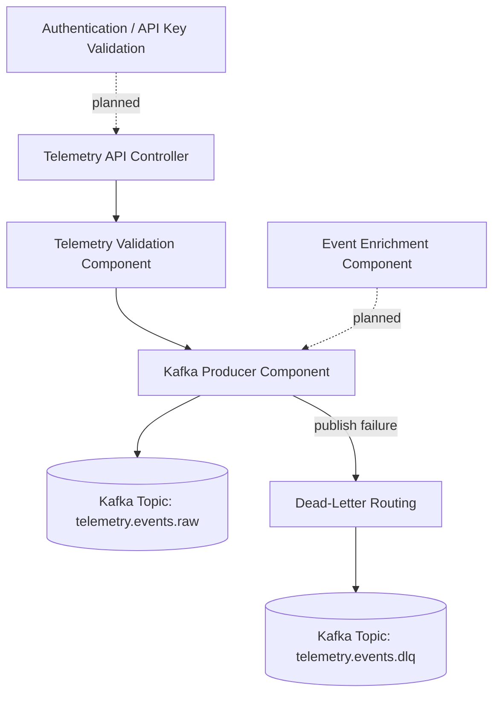
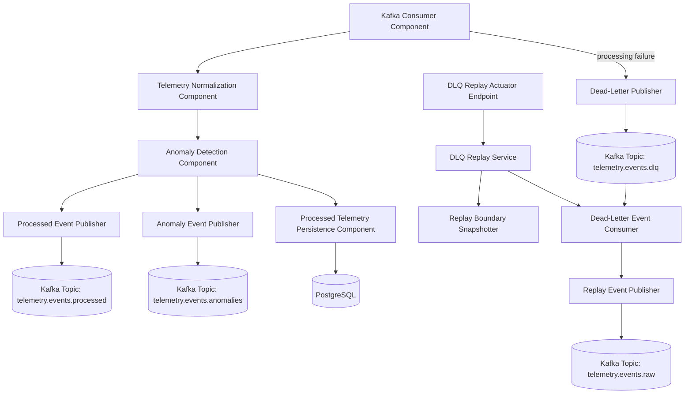

# C4 Model

This document describes the PulseStream platform using the C4 model.

The C4 model presents software architecture through four levels of abstraction:

- Context
- Container
- Component
- Code

For the current stage of PulseStream, this document focuses on the first three levels.

Status words used below — **Planned**, **Implemented**, **Validated** — are defined in [`PROJECT_STATE.md`](../../PROJECT_STATE.md#how-to-read-status-in-this-repository), which is the authoritative record of platform status. In the diagrams, solid edges are implemented and dashed edges are planned.

---

# Level 1 — System Context

The System Context view shows how PulseStream interacts with external users and systems.

## Description

PulseStream is a cloud-native platform that ingests IoT telemetry events, processes them through a streaming backbone, detects anomalies, persists processed telemetry, and dead-letters failures for deliberate replay. Query access for downstream clients is planned.

External actors include:

- IoT devices and gateways that send telemetry
- future platform users or API clients that query processed data
- operators who monitor platform health, and who trigger dead-letter replay

## Context Diagram

```mermaid
flowchart LR
    D[IoT Devices / Gateways]
    U[API Clients / Dashboards]
    O[Platform Operators]

    P[PulseStream Platform]

    D -->|Send telemetry events| P
    P -. planned query APIs for processed telemetry .-> U
    O -->|Monitor metrics and traces| P
    O -->|Trigger dead-letter replay| P
```

Notes
- IoT devices and gateways are the primary producers of telemetry events.
- API clients and dashboards will consume processed platform data once a query API exists.
- Platform operators use observability tooling to monitor system health, and the `dlqreplay` actuator endpoint to replay dead-lettered events.

## Level 2 — Container View

The Container view shows the major deployable/runtime building blocks of the platform.

Description

PulseStream is composed of services and infrastructure that work together to ingest, process, and store telemetry data. The query container is a scaffold; every other container listed is running.

Container Diagram

```mermaid
flowchart LR
    A[IoT Devices] --> B[Ingestion Service]
    B --> C[(Kafka Cluster)]

    C --> D[Telemetry Processor]
    D --> E[(PostgreSQL)]
    E -. planned .-> F[Query Service scaffold]
    F -. planned .-> G[API Clients / Dashboards]

    D --> H[(telemetry.events.processed)]
    D --> I[(telemetry.events.anomalies)]
    B --> J[(telemetry.events.dlq)]
    D --> J
    J -->|selective replay| C

    subgraph Observability
        K[Prometheus]
        L[Grafana]
        M[OpenTelemetry]
        N[Jaeger]
    end

    B --> K
    D --> K
    F --> K

    B --> M
    D --> M
    F -. not instrumented .-> M

    M --> N
    K --> L
```

## Containers

| Container | Responsibility | Technology | Status |
| --- | --- | --- | --- |
| Ingestion Service | Accept telemetry events, publish them to Kafka, dead-letter publish failures | Spring Boot | Implemented |
| Kafka Cluster | Event streaming backbone | Apache Kafka; Strimzi in KRaft mode on Kubernetes | Implemented |
| Telemetry Processor | Consume telemetry events, normalize, detect anomalies, persist, dead-letter failures, replay on demand | Spring Boot | Implemented |
| Query Service | API for processed telemetry and anomaly data | Spring Boot | Scaffold — no query endpoints |
| PostgreSQL | Persist normal processed telemetry records | PostgreSQL | Implemented for the write path; no Kubernetes manifest committed |
| Observability Stack | Metrics, dashboards and distributed tracing | Prometheus, Grafana, OpenTelemetry, Jaeger | Complete under Docker Compose; on Kubernetes only the OpenTelemetry Collector is deployed |
| Device Simulator | Synthetic telemetry traffic generator | Not chosen | Planned — no implementation exists |

Notes
- Kafka is the central asynchronous communication layer.
- Services are loosely coupled and communicate primarily through events.
- PostgreSQL stores processed results, not the full streaming backbone.
- Prometheus, Grafana and Jaeger run in the local development stack. In the cluster, the two stream-path services export OTLP to a collector whose traces terminate in a `debug` exporter; no metrics stack is deployed there yet.

## Level 3 — Component View

The Component view zooms into one container and describes its internal parts.

For PulseStream, the most important container to detail first is the Ingestion Service.

Ingestion Service Components

```mermaid
flowchart TB
    A[Telemetry API Controller] --> B[Telemetry Validation Component]
    B --> D[Kafka Producer Component]
    D --> E[(Kafka Topic: telemetry.events.raw)]
    D -->|publish failure| G[Dead-Letter Routing]
    G --> H[(Kafka Topic: telemetry.events.dlq)]

    C[Event Enrichment Component] -. planned .-> D
    F[Authentication / API Key Validation] -. planned .-> A
```

## Ingestion Service Component Responsibilities

| Component                           | Responsibility                                    |
| ----------------------------------- | ------------------------------------------------- |
| Telemetry API Controller            | Accept incoming HTTP telemetry requests           |
| Authentication / API Key Validation | Planned producer identity and access validation ([#273](https://github.com/ME-Massine/pulsestream/issues/273)) |
| Telemetry Validation Component      | Validate the event schema and required fields; a global exception handler maps failures to error responses |
| Event Enrichment Component          | Planned metadata enrichment such as timestamps or source details |
| Kafka Producer Component            | Publish validated events to Kafka with `acks=all` and bounded delivery and publish timeouts |
| Dead-Letter Routing                 | On publish failure, emit a `DeadLetterEvent` carrying the original event and error metadata to `telemetry.events.dlq` |

Notes
- The ingestion service should remain stateless.
- Business processing should not happen here.
- The ingestion service should validate and forward events, not analyze them.

## Level 3 — Component View (Telemetry Processor)

The Telemetry Processor is the core event-processing service of the platform.

Telemetry Processor Components

```mermaid
flowchart TB
    A[Kafka Consumer Component] --> B[Telemetry Normalization Component]
    B --> C[Anomaly Detection Component]
    C --> D[Processed Event Publisher]
    C --> E[Anomaly Event Publisher]
    C --> F[Processed Telemetry Persistence Component]

    D --> G[(Kafka Topic: telemetry.events.processed)]
    E --> H[(Kafka Topic: telemetry.events.anomalies)]
    F --> I[(PostgreSQL)]

    A -->|processing failure| J[Dead-Letter Publisher]
    J --> K[(Kafka Topic: telemetry.events.dlq)]

    L[DLQ Replay Actuator Endpoint] --> M[DLQ Replay Service]
    M --> N[Replay Boundary Snapshotter]
    M --> O[Dead-Letter Event Consumer]
    K --> O
    O --> P[Replay Event Publisher]
    P --> Q[(Kafka Topic: telemetry.events.raw)]
```

## Telemetry Processor Component Responsibilities

| Component                         | Responsibility                                     |
| --------------------------------- | -------------------------------------------------- |
| Kafka Consumer Component          | Consume raw telemetry events from Kafka            |
| Telemetry Normalization Component | Standardize incoming telemetry data                |
| Anomaly Detection Component       | Apply anomaly rules and identify abnormal readings |
| Processed Event Publisher         | Publish normalized telemetry events                |
| Anomaly Event Publisher           | Publish anomaly events                             |
| Processed Telemetry Persistence Component | Store normal processed telemetry records |
| Dead-Letter Publisher | Emit failed processing events to `telemetry.events.dlq` with error metadata |
| DLQ Replay Actuator Endpoint | `dlqreplay` — start and stop bounded replay. State-changing and unauthenticated, so it is served on a loopback-bound management port |
| Replay Boundary Snapshotter | Capture per-partition end offsets when replay is triggered, so a replay cannot chase its own output |
| Dead-Letter Event Consumer | Read `telemetry.events.dlq` in a dedicated consumer group up to the captured boundary, with an idle-timeout fallback |
| Replay Event Publisher | Republish only operator-selected `eventId`s to `telemetry.events.raw`, carrying replay headers |

Notes

- The processor is the main data-processing engine of the platform.
- Anomaly detection rules should be isolated and extensible. Detection state is held per replica today, so it is not deterministic under horizontal scaling ([#269](https://github.com/ME-Massine/pulsestream/issues/269)).
- Output flows are separated into processed, anomalous, persistent, and dead-letter paths. **Anomaly persistence is not implemented in application code** ([#267](https://github.com/ME-Massine/pulsestream/issues/267)).
- The replay path is deliberately separate from the main consumer: its own consumer group, its own bounded lifecycle, and an operator-supplied selection without which a `start` request is rejected. See [`event-replay-strategy.md`](event-replay-strategy.md).

## Level 4 — Code View

The Code view is intentionally kept lightweight. The services exist under `services/ingestion-service`, `services/telemetry-processor`, and `services/query-service` — the last of which is a scaffold with no domain code.

Expected future additions:

- package/module structure for ingestion service
- package/module structure for telemetry processor
- service-level class diagrams if needed
- source code organization by domain and responsibility

## Summary

The C4 model helps describe PulseStream from multiple perspectives:

- System Context explains how the platform interacts with external actors
- Container View shows the major runtime building blocks
- Component View explains the internal structure of the most important services

This model complements the system overview, service architecture, and diagrams already present in the repository.
