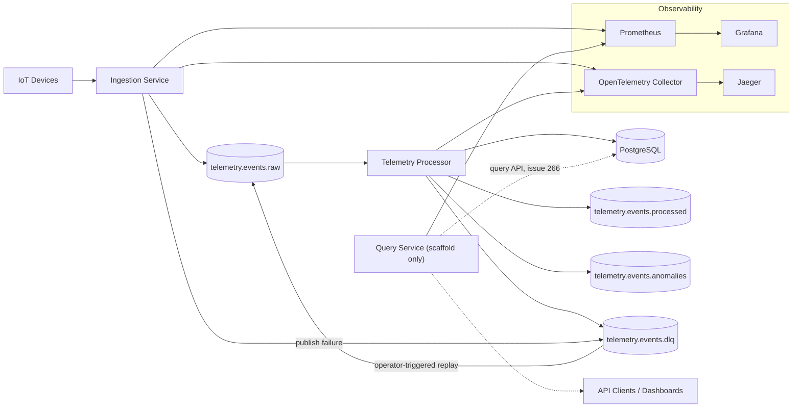
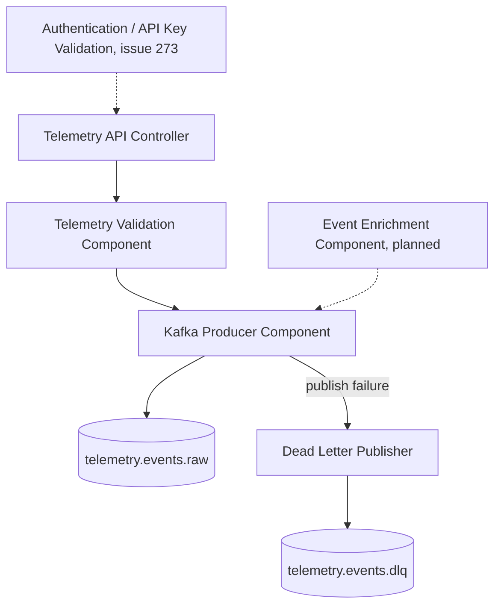
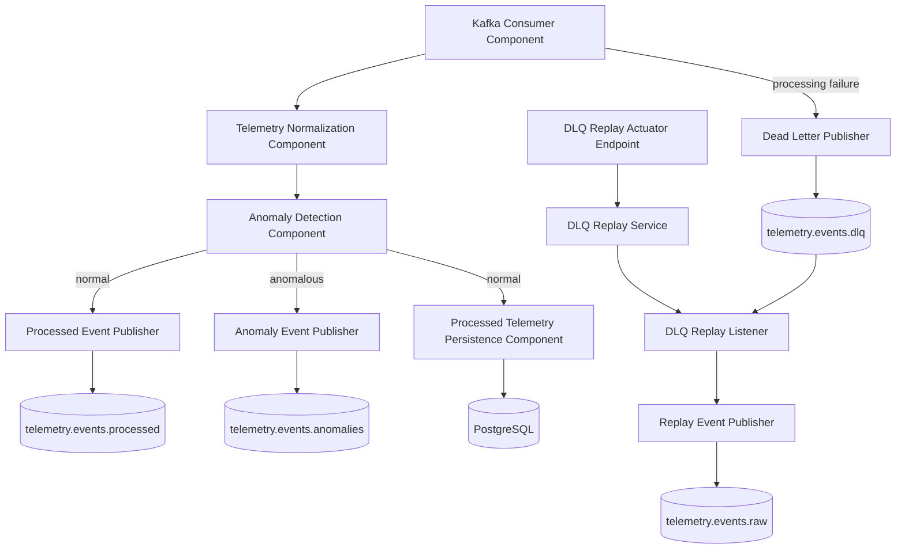

# C4 Model

This document describes the PulseStream platform using the C4 model.

The C4 model presents software architecture through four levels of abstraction:

- Context
- Container
- Component
- Code

For the current stage of PulseStream, this document focuses on the first three levels.

Planned elements are labelled with the issue that tracks them. [PROJECT_STATE.md](../../PROJECT_STATE.md) is the authoritative record of platform status.

---

# Level 1 — System Context

The System Context view shows how PulseStream interacts with external users and systems.

## Description

PulseStream is a cloud-native platform that ingests IoT telemetry events, processes them through a streaming backbone, detects anomalies, persists processed telemetry, and preserves and replays events that fail. Query access for downstream clients is planned (#266).

External actors include:

- IoT devices and gateways that send telemetry
- future platform users or API clients that query processed data
- operators who monitor platform health and observability dashboards

## Context Diagram

```mermaid
flowchart LR
    D[IoT Devices / Gateways]
    U[API Clients / Dashboards]
    O[Platform Operators]

    P[PulseStream Platform]

    D -->|Send telemetry events| P
    P -.->|Query APIs for processed telemetry, issue 266| U
    O -->|Monitor metrics, logs and traces| P
    O -->|Trigger dead-letter replay| P
```

Notes
- IoT devices and gateways are the primary producers of telemetry events. The ingestion API is unauthenticated today (#273).
- API clients and dashboards will consume processed platform data; the query API does not exist yet (#266).
- Platform operators use observability tooling to monitor system health, and are the only trigger for dead-letter replay.

## Level 2 — Container View

The Container view shows the major deployable/runtime building blocks of the platform.

Description

PulseStream is composed of services and infrastructure that work together to ingest, process, store and recover telemetry data.

Container Diagram

```mermaid
flowchart LR
    A[IoT Devices] --> B[Ingestion Service]
    B --> C[(telemetry.events.raw)]

    C --> D[Telemetry Processor]
    D --> E[(PostgreSQL)]
    D --> H[(telemetry.events.processed)]
    D --> I[(telemetry.events.anomalies)]
    D --> J[(telemetry.events.dlq)]
    B -- publish failure --> J
    J -- operator-triggered replay --> C

    F["Query Service (scaffold only)"] -. query API, issue 266 .-> E
    F -.-> G[API Clients / Dashboards]

    subgraph Observability
        K[Prometheus]
        L[Grafana]
        M[OpenTelemetry Collector]
        N[Jaeger]
    end

    B --> K
    F --> K
    B --> M
    D --> M
    M --> N
    K --> L
```

Solid edges are implemented; dotted edges are planned. The Telemetry Processor is not a Prometheus target: its actuator surface, including the state-changing `dlqreplay` endpoint, is bound to loopback on a separate management port.

## Containers

| Container           | Responsibility                                             | Technology                                 |
| ------------------- | ---------------------------------------------------------- | ------------------------------------------ |
| Ingestion Service   | Accept telemetry events, publish them to Kafka, and dead-letter what cannot be published | Spring Boot |
| Kafka Cluster       | Event streaming backbone; Strimzi-managed in KRaft mode in Kubernetes | Apache Kafka |
| Telemetry Processor | Consume telemetry events, normalize, detect anomalies, persist normal readings, dead-letter failures, and replay selected dead-letter events | Spring Boot |
| Query Service       | Scaffold: actuator endpoints only, no REST API and no data access (#266) | Spring Boot |
| PostgreSQL          | Persist processed telemetry records; not provisioned inside Kubernetes | PostgreSQL |
| Observability Stack | Metrics, dashboards and distributed tracing | Prometheus, Grafana, OpenTelemetry, Jaeger |
| Device Simulator    | Planned synthetic telemetry traffic generator; none exists here | Spring Boot or lightweight simulator |

Notes
- Kafka is the central asynchronous communication layer.
- Services are loosely coupled and communicate primarily through events.
- PostgreSQL stores processed results, not the full streaming backbone. Only normal readings are persisted; anomalies are published to Kafka and not stored (#267).
- Prometheus, Grafana and OpenTelemetry are deployed in both environments. In-cluster Grafana has no datasource yet (#156) and there is no in-cluster tracing backend (#158).

## Level 3 — Component View

The Component view zooms into one container and describes its internal parts.

For PulseStream, the most important container to detail first is the Ingestion Service.

Ingestion Service Components

```mermaid
flowchart TB
    A[Telemetry API Controller] --> B[Telemetry Validation Component]
    B --> D[Kafka Producer Component]
    D --> E[(telemetry.events.raw)]
    D -- publish failure --> G[Dead Letter Publisher]
    G --> H[(telemetry.events.dlq)]

    C[Event Enrichment Component, planned] -.-> D
    F[Authentication / API Key Validation, issue 273] -.-> A
```

## Ingestion Service Component Responsibilities

| Component                           | Responsibility                                    |
| ----------------------------------- | ------------------------------------------------- |
| Telemetry API Controller            | Accept incoming HTTP telemetry requests; instrumented for OpenTelemetry HTTP server spans |
| Authentication / API Key Validation | Planned producer identity and access validation (#273) |
| Telemetry Validation Component      | Validate the event schema and required fields     |
| Event Enrichment Component          | Planned metadata enrichment such as timestamps or source details |
| Kafka Producer Component            | Publish validated events to Kafka. Built from hand-configured `ProducerFactory` beans, which are not trace-instrumented (#294) |
| Dead Letter Publisher               | Preserve an accepted event as a `DeadLetterEvent` on the DLQ when publishing fails |

Notes
- The ingestion service should remain stateless.
- Business processing should not happen here.
- The ingestion service should validate and forward events, not analyze them.

## Level 3 — Component View (Telemetry Processor)

The Telemetry Processor is the core event-processing service of the platform.

Telemetry Processor Components

```mermaid
flowchart TB
    A[Kafka Consumer Component] --> B[Telemetry Normalization Component]
    B --> C[Anomaly Detection Component]
    C -- normal --> D[Processed Event Publisher]
    C -- normal --> F[Processed Telemetry Persistence Component]
    C -- anomalous --> E[Anomaly Event Publisher]
    A -- processing failure --> K[Dead Letter Publisher]

    D --> G[(telemetry.events.processed)]
    E --> H[(telemetry.events.anomalies)]
    F --> I[(PostgreSQL)]
    K --> J[(telemetry.events.dlq)]

    L[DLQ Replay Actuator Endpoint] --> M[DLQ Replay Service]
    M --> N[DLQ Replay Listener]
    J --> N
    N --> O[Replay Event Publisher]
    O --> P[(telemetry.events.raw)]
```

## Telemetry Processor Component Responsibilities

| Component                         | Responsibility                                     |
| --------------------------------- | -------------------------------------------------- |
| Kafka Consumer Component          | Consume raw telemetry events from Kafka; dead-letters on first failure, with no retry policy |
| Telemetry Normalization Component | Standardize incoming telemetry data                |
| Anomaly Detection Component       | Apply anomaly rules and identify abnormal readings. State is per-instance, so results are not deterministic beyond one replica (#269) |
| Processed Event Publisher         | Publish normalized telemetry events                |
| Anomaly Event Publisher           | Publish anomaly events                             |
| Processed Telemetry Persistence Component | Store normal processed telemetry records, upserted by `event_id` |
| Dead Letter Publisher             | Write a `DeadLetterEvent` with error metadata to the DLQ |
| DLQ Replay Actuator Endpoint      | Operator trigger to start and stop a replay run; served on a loopback-bound management port because it is state-changing and unauthenticated |
| DLQ Replay Service                | Snapshot per-partition end offsets, run the listener within those bounds, and stop it |
| DLQ Replay Listener               | Read dead-letter records under its own consumer group; registered with `autoStartup=false` |
| Replay Event Publisher            | Republish the selected events to the raw topic with replay markers |

Notes

- The processor is the main data-processing engine of the platform.
- Anomaly detection rules should be isolated and extensible.
- The normal and anomalous paths are exclusive: an anomalous reading is published to the anomalies topic only, and is neither persisted nor republished as processed telemetry. Anomaly persistence is planned (#267).
- Replay is selective and bounded, so a replay run cannot consume its own output and cannot republish records the operator did not choose.

## Level 4 — Code View

The Code view is intentionally kept lightweight. Three service modules exist: `services/ingestion-service`, `services/telemetry-processor` and `services/query-service` (a scaffold). Each is organized by domain and responsibility - `config`, `controller` or `consumer`, `dto` and `model`, `service`, `repository` - and the package layout is the current source of truth.

Expected future additions:

- service-level class diagrams if needed
- component structure for `query-service` once the query API exists (#266)

## Summary

The C4 model helps describe PulseStream from multiple perspectives:

- System Context explains how the platform interacts with external actors
- Container View shows the major runtime building blocks
- Component View explains the internal structure of the most important services

This model complements the system overview, service architecture, and diagrams already present in the repository.
