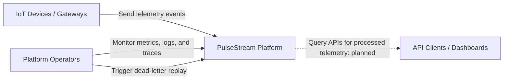
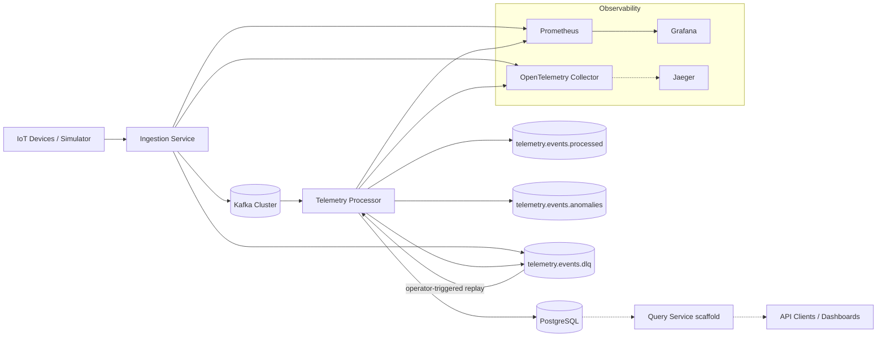
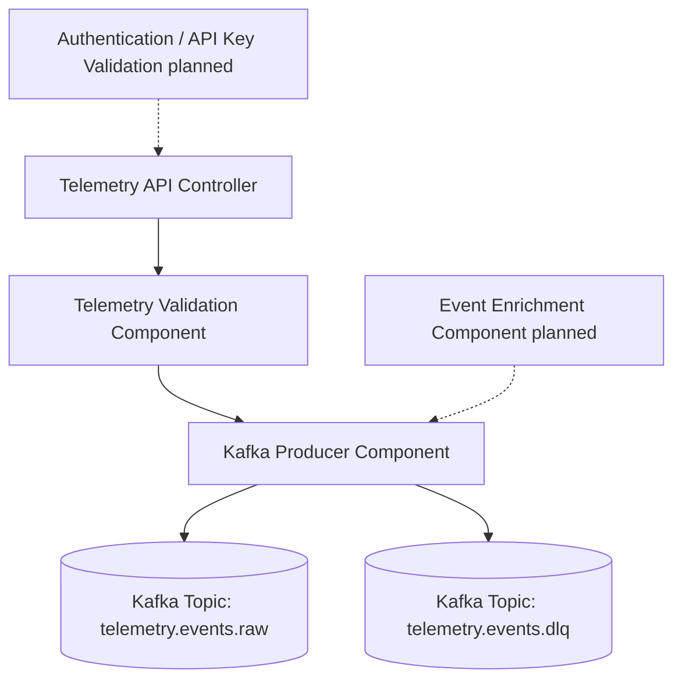
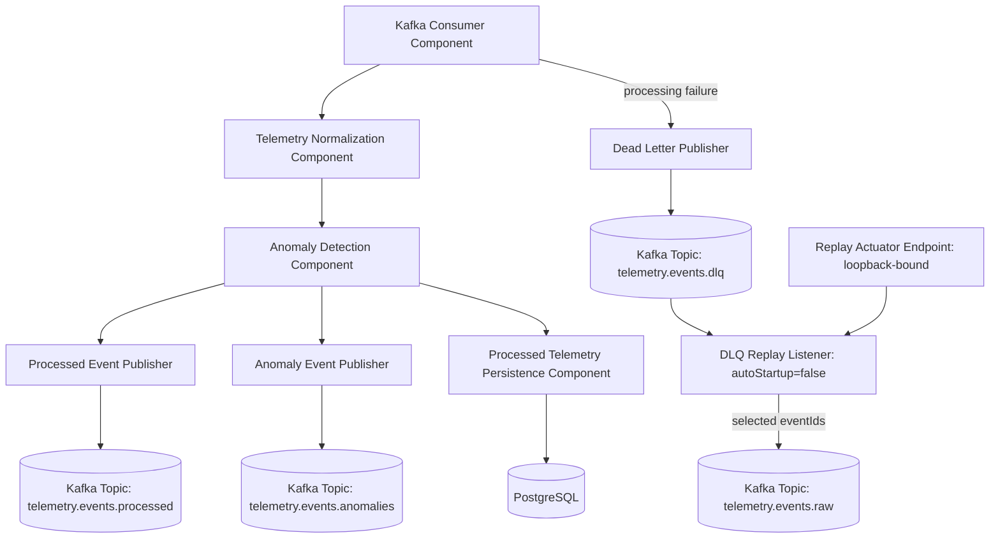

# C4 Model

This document describes the PulseStream platform using the C4 model.

The C4 model presents software architecture through four levels of abstraction:

- Context
- Container
- Component
- Code

For the current stage of PulseStream, this document focuses on the first three levels.

---

# Level 1 — System Context

The System Context view shows how PulseStream interacts with external users and systems.

## Description

PulseStream is a cloud-native platform that ingests IoT telemetry events, processes them through a streaming backbone, detects anomalies, and persists processed telemetry. Query access for downstream clients is planned ([#266](https://github.com/ME-Massine/pulsestream/issues/266)).

External actors include:

- IoT devices and gateways that send telemetry
- future platform users or API clients that query processed data
- operators who monitor platform health, and who trigger dead-letter replay

## Context Diagram

```mermaid
flowchart LR
    D[IoT Devices / Gateways]
    U[API Clients / Dashboards]
    O[Platform Operators]

    P[PulseStream Platform]

    D -->|Send telemetry events| P
    P -.->|Query APIs for processed telemetry: planned| U
    O -->|Monitor metrics, logs, and traces| P
    O -->|Trigger dead-letter replay| P
```

Notes
- IoT devices and gateways are the primary producers of telemetry events.
- API clients and dashboards consume processed platform data.
- Platform operators use observability tooling to monitor system health.

## Level 2 — Container View

The Container view shows the major deployable/runtime building blocks of the platform.

Description

PulseStream is composed of services and infrastructure that work together to ingest, process, and store telemetry data. Tracing is instrumented and collected; the query container is deployed but empty. Dashed edges below are paths that do not exist yet.

Container Diagram

```mermaid
flowchart LR
    A[IoT Devices / Simulator] --> B[Ingestion Service]
    B --> C[(Kafka Cluster)]

    C --> D[Telemetry Processor]
    D --> E[(PostgreSQL)]
    E -.-> F[Query Service scaffold]
    F -.-> G[API Clients / Dashboards]

    D --> H[(telemetry.events.processed)]
    D --> I[(telemetry.events.anomalies)]
    B --> J[(telemetry.events.dlq)]
    D --> J
    J -->|operator-triggered replay| D

    subgraph Observability
        K[Prometheus]
        L[Grafana]
        M[OpenTelemetry Collector]
        N[Jaeger]
    end

    B --> K
    D --> K

    B --> M
    D --> M

    M -.-> N
    K --> L
```

## Containers

| Container           | Responsibility                                             | Technology                                 |
| ------------------- | ---------------------------------------------------------- | ------------------------------------------ |
| Ingestion Service   | Accept telemetry events and publish them to Kafka          | Spring Boot                                |
| Kafka Cluster       | Event streaming backbone                                   | Apache Kafka                               |
| Telemetry Processor | Consume telemetry events, normalize data, detect anomalies | Spring Boot                                |
| Query Service       | Deployed scaffold; no endpoints or data access yet         | Spring Boot                                |
| PostgreSQL          | Persist processed telemetry records                        | PostgreSQL                                 |
| Observability Stack | Metrics, dashboards, and traces locally; collector in-cluster | Prometheus, Grafana, OpenTelemetry, Jaeger |
| Device Simulator    | Not present in the repository                              | n/a                                        |

Notes
- Kafka is the central asynchronous communication layer.
- Services are loosely coupled and communicate primarily through events.
- PostgreSQL stores processed results, not the full streaming backbone.
- Prometheus, Grafana, and Jaeger are provisioned locally. In Kubernetes only the OpenTelemetry Collector is deployed, and traces terminate in its `debug` exporter ([#32](https://github.com/ME-Massine/pulsestream/issues/32)).
- `telemetry.events.dlq` is fed by both services and drained selectively by operator-triggered replay.

## Level 3 — Component View

The Component view zooms into one container and describes its internal parts.

For PulseStream, the most important container to detail first is the Ingestion Service.

Ingestion Service Components

```mermaid
flowchart TB
    A[Telemetry API Controller] --> B[Telemetry Validation Component]
    B --> D[Kafka Producer Component]
    D --> E[(Kafka Topic: telemetry.events.raw)]

    D --> F[(Kafka Topic: telemetry.events.dlq)]

    C[Event Enrichment Component planned] -.-> D
    G[Authentication / API Key Validation planned] -.-> A
```

## Ingestion Service Component Responsibilities

| Component                           | Responsibility                                    |
| ----------------------------------- | ------------------------------------------------- |
| Telemetry API Controller            | Accept incoming HTTP telemetry requests           |
| Authentication / API Key Validation | Planned producer identity and access validation   |
| Telemetry Validation Component      | Validate the event schema and required fields     |
| Event Enrichment Component          | Planned metadata enrichment such as timestamps or source details |
| Kafka Producer Component            | Publish validated events to Kafka, and preserve an event in the dead-letter topic when that publish fails |

Notes
- The ingestion service should remain stateless.
- Business processing should not happen here.
- The ingestion service should validate and forward events, not analyze them.

## Level 3 — Component View (Telemetry Processor)

The Telemetry Processor is the core event-processing service of the platform.

Telemetry Processor Components

```mermaid
flowchart TB
    A[Kafka Consumer Component] --> B[Telemetry Normalization Component]
    B --> C[Anomaly Detection Component]
    C --> D[Processed Event Publisher]
    C --> E[Anomaly Event Publisher]
    C --> F[Processed Telemetry Persistence Component]

    A -->|processing failure| K[Dead Letter Publisher]
    K --> L[(Kafka Topic: telemetry.events.dlq)]
    L --> M[DLQ Replay Listener: autoStartup=false]
    N[Replay Actuator Endpoint: loopback-bound] --> M
    M -->|selected eventIds| J[(Kafka Topic: telemetry.events.raw)]

    D --> G[(Kafka Topic: telemetry.events.processed)]
    E --> H[(Kafka Topic: telemetry.events.anomalies)]
    F --> I[(PostgreSQL)]
```

## Telemetry Processor Component Responsibilities

| Component                         | Responsibility                                     |
| --------------------------------- | -------------------------------------------------- |
| Kafka Consumer Component          | Consume raw telemetry events from Kafka            |
| Telemetry Normalization Component | Standardize incoming telemetry data                |
| Anomaly Detection Component       | Apply anomaly rules and identify abnormal readings |
| Processed Event Publisher         | Publish normalized telemetry events                |
| Anomaly Event Publisher           | Publish anomaly events                             |
| Processed Telemetry Persistence Component | Store normal processed telemetry records, upserting by `event_id` so a replay replaces rather than duplicates |
| Dead Letter Publisher             | Wrap a failed event with error metadata and route it to the dead-letter topic on the first failure |
| DLQ Replay Listener               | Idle until started; scans dead-letter records and republishes only operator-selected `eventId`s |
| Replay Actuator Endpoint          | Start and stop the replay listener, served on a loopback-bound management port |

Notes

- The processor is the main data-processing engine of the platform.
- Anomaly detection rules should be isolated and extensible.
- Output flows are separated into processed, anomalous, persistent, and dead-letter paths. Anomaly persistence is planned but not implemented in application code yet ([#267](https://github.com/ME-Massine/pulsestream/issues/267)).
- There is no retry policy on the listener container: a processing failure reaches the dead-letter topic on the first attempt, and recovery is by replay. See [event-replay-strategy.md](./event-replay-strategy.md).

## Level 4 — Code View

The Code view is intentionally kept lightweight. Services live under `services/ingestion-service`, `services/telemetry-processor`, and `services/query-service`, each organized by responsibility into `config`, `controller`/`consumer`, `service`, `model`, and `repository` packages.

Expected future additions:

- service-level class diagrams if needed
- a component view for `query-service` once it has functionality

## Summary

The C4 model helps describe PulseStream from multiple perspectives:

- System Context explains how the platform interacts with external actors
- Container View shows the major runtime building blocks
- Component View explains the internal structure of the most important services

This model complements the system overview, service architecture, and diagrams already present in the repository.
