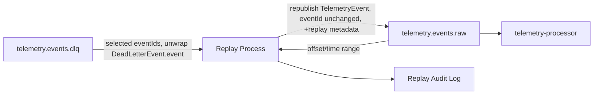

# Event Replay Strategy

## Overview

This document defines the strategy for replaying events in PulseStream. Replay is used to recover from failed event processing or to reprocess historical telemetry after a downstream fix, reusing the existing `telemetry.events.raw` topic and consumer rather than introducing new infrastructure (see [Alignment with Architecture](#alignment-with-architecture)).

This document covers **strategy and scope only**. Implementation is tracked separately:

- **#123** — Implement DLQ consumer for event replay
- **#124** — Republish replayed events to `telemetry.events.raw`
- **#126** — Add safeguards for replayed events (the replay marker, the upsert-by-`event_id`
  persistence change, replay-metadata transport, and consumer-side dedup contract described below are
  the *design* those safeguards will implement; this doc intentionally defines their strategy, and #126
  owns the implementation)

---

## Replay Sources

### 1. Dead Letter Queue (`telemetry.events.dlq`)

- Primary replay source.
- Contains events routed to the DLQ by **either** service, both writing the shared `DeadLetterEvent`
  structure and identifying themselves via `sourceService`:
  - **`ingestion-service`** — when publishing an accepted event to `telemetry.events.raw` fails, it
    preserves the event in the DLQ so it is not lost.
  - **`telemetry-processor`** — when `TelemetryEventConsumer` processing throws, it routes the event to
    the DLQ **directly on first failure**; there is no configured processing retry policy on the
    listener container, so a processor-sourced DLQ record means "failed once," not "retries exhausted."
- See [topics.md](./topics.md) and [event-schema.md](./event-schema.md) for the topic and envelope.
- Each DLQ record is a `DeadLetterEvent` **wrapper** (nested `event` plus failure metadata), so replay
  must unwrap the nested `TelemetryEvent` before republishing — see [Replay Flow](#replay-flow).
- Replay targets specific failed events by `eventId`.
- Low blast radius — only previously-failed events are affected.

### 2. Raw topic (`telemetry.events.raw`)

- Used for bulk reprocessing: schema migrations, bug fixes in `telemetry-processor` that require reprocessing telemetry that was already handled once.
- Replay targets a time range or offset range rather than individual event IDs.
- Higher blast radius — replays events that already flowed through the system once, so downstream consumers and the `telemetry.events.processed` topic are affected.
- **Bounded to avoid self-consumption.** Because raw-topic replay both *reads from* and *republishes
  to* `telemetry.events.raw`, it must not consume the records it just produced (which would loop
  indefinitely). The replay process **snapshots the current end offset of each partition at replay
  start** and only consumes up to those fixed ending offsets. Records republished during the run land
  at offsets beyond the snapshot and are therefore never re-read by the same run. An offset/time
  selection also naturally terminates at a past boundary; the end-offset snapshot is the required rule
  when the selection is expressed as "everything up to now."

---

## Replay Trigger Mechanism

- Replay is **manually triggered** by an operator (CLI or admin endpoint) specifying:
  - source (`dlq` or `raw`)
  - selection (event IDs for DLQ, offset/time range for raw)
- There is no automatic retry loop from the DLQ. Keeping replay manual bounds the blast radius and keeps a human in the loop for bulk raw-topic replays.

### DLQ replay trigger (#125)

DLQ replay is triggered through an actuator endpoint on `telemetry-processor`. Because the trigger is **state-changing** and the service is not yet fronted by authentication, the management surface is served on its own port bound to loopback by default (`management.server.port`/`management.server.address`, defaults `9083`/`127.0.0.1`) rather than on the main service port — so start/stop of replay is reachable only from the host, not from anyone able to reach the service port. The trigger starts and stops the `dlq-replay-listener` container, which is registered with `autoStartup=false` and otherwise stays idle:

| Operation | Effect |
|-----------|--------|
| `GET /actuator/dlqreplay` | Report whether the replay listener is running and which `eventId`s it is replaying |
| `POST /actuator/dlqreplay/start` | Replay the **selected** events — body must supply `eventId`s as a comma-delimited string, e.g. `{"eventIds": "evt-1,evt-2"}` |
| `POST /actuator/dlqreplay/stop` | Stop the listener |

Replay is **selective and bounded**, matching this strategy ("replay targets specific failed events by `eventId`", "no automatic retry loop from the DLQ"):

- **Selective.** Only records whose `eventId` is in the operator-supplied selection are republished to `telemetry.events.raw`; every other dead-letter record read during the scan is skipped. A `start` without a non-empty selection is rejected (`400`). Future dead-letter records that were not selected are never automatically replayed.
- **Repeatable.** On each `start` the listener rewinds its partitions to the beginning, so an operator can target any historical dead-letter `eventId` regardless of what a previous run consumed.
- **Bounded.** Once the listener has drained the backlog present when it was triggered it goes idle and stops itself, so it does not stay running to sweep up future dead-letter records. `start`/`stop` are idempotent, and the listener also stops itself on a failed republish (no-data-loss policy from #124), so the record is redelivered on the next `start`.

Offset/time-range selection for raw-topic replay is not covered by this trigger.
- Replayed events are published back to **`telemetry.events.raw`** — the same topic they originated from (directly, for raw-sourced replay, or after being read out of the DLQ, for DLQ-sourced replay). This matches #124's scope ("publish events back to `telemetry.events.raw`") and avoids introducing a topic that isn't defined in [topics.md](./topics.md) or provisioned anywhere. There is no separate `telemetry.events.replay` topic.
- Each replayed event carries additional replay metadata alongside the standard envelope defined in [event-schema.md](./event-schema.md) (carried as Kafka headers or envelope fields — see below):

| Field        | Description                                  |
|--------------|-----------------------------------------------|
| `replay`     | `true` — marks the event as a replay          |
| `replayedAt` | Timestamp the replay was triggered            |
| `replaySource` | `dlq` or `raw` — where the event was replayed from |

**How this metadata reaches the processor.** The current `TelemetryEvent` envelope (see
`services/telemetry-processor/.../model/TelemetryEvent.java` and [event-schema.md](./event-schema.md))
has no `replay`/`replayedAt`/`replaySource` fields, so these cannot travel today. Carrying them
requires one of two transport choices, deferred to the replay safeguards follow-up (#126):

- **Kafka record headers** — attach replay metadata as headers on the republished record, leaving the
  JSON envelope and the `TelemetryEvent` record untouched. Preferred, because it keeps replay metadata
  out of the persisted business schema and off the processed/anomaly envelopes.
- **Envelope extension** — add optional replay fields to the shared envelope and the `TelemetryEvent`
  record. Simpler to consume but changes a schema shared across services.

Until that follow-up lands, replay is **transparent** to the processor: a replayed event is processed
exactly like any other `telemetry.events.raw` event, and the metadata above is audit/observability
information only. No processor behavior may depend on it before the transport is defined.

`eventId` is **not** regenerated for a replay — see below.

### Replay Event Identity and Idempotency

`telemetry-processor` currently persists processed events to the `processed_telemetry` table with a
unique constraint on `event_id` (see `ProcessedTelemetryPersistenceService`), and a duplicate insert
is skipped as a no-op. That skip-on-duplicate behavior is correct for ordinary at-least-once Kafka
redelivery of the *same* event, but replay has a different goal: a raw-topic replay is meant to
**produce a corrected result for an event that already has one**, not to create a second, unrelated
result next to the first.

**Rule: a replayed event always keeps the `eventId` of the event it replays.** No new `eventId` is
minted, and no separate `originalEventId` field is needed, because `eventId` itself never changes.

**A DLQ record may or may not already have a persisted row.** The earlier assumption that "DLQ events
were never persisted" is not correct for this pipeline. `TelemetryProcessingService.process()`
persists the `processed_telemetry` row **before** publishing the processed event
(`persistenceService.persist(...)` then `processedTelemetryPublisher.publish(...)`), and
`TelemetryEventConsumer` routes **any** subsequent `RuntimeException` to the DLQ. So there are two
distinct DLQ failure classes:

- **Pre-persistence failure** (e.g. normalization/validation threw, or persistence itself failed): no
  row exists. Reprocessing under the original `eventId` is effectively a plain insert.
- **Post-persistence failure** (e.g. the processed-topic publish failed *after* the row was written):
  a `processed_telemetry` row for that `event_id` **already exists**, even though the event landed in
  the DLQ.

Because the replay path cannot tell these two apart up front — and the anomaly path
(`AnomalyProcessingService`) has no persistence at all — replay must **not** assume a plain insert for
DLQ-sourced events. Instead, **both DLQ-sourced and raw-topic replay use the same persistence
contract: upsert by `event_id`** (insert-or-replace) rather than today's skip-on-duplicate no-op. This
guarantees a replay supersedes any prior row if one exists and creates one if it does not, for either
source. That persistence change is a behavior change from today's skip-on-duplicate logic and is
**scoped to the replay safeguards follow-up (#126)** — it is not part of this strategy doc.

This also answers the "replaying the same source twice" case: because the `eventId` is always the
original one, re-triggering a replay upserts the same row again rather than creating an additional row
— the persisted state converges to the latest replay's result instead of accumulating duplicates.

**Limitation: convergence holds only when classification does not cross the normal/anomaly boundary.**
The processor persists a `processed_telemetry` row only for **normal** events;
`AnomalyProcessingService` publishes to `telemetry.events.anomalies` and writes **no** row. So the
upsert-by-`event_id` convergence above is complete only for normal→normal replays. The boundary cases
are *not* reconciled by upsert alone:

- **Normal → anomaly on replay:** the new run takes the anomaly branch and never touches
  `processed_telemetry`, so the original (now-incorrect) normal row is **left behind** — upsert never
  fires because nothing writes the table.
- **Anomaly → normal on replay:** the new run inserts a normal row (none existed, since anomalies were
  never persisted); the previously emitted anomaly message on `telemetry.events.anomalies` remains as
  historical audit.

Reconciling reclassification — i.e. **retracting, tombstoning, or versioning** the stale
`processed_telemetry` row when an event flips normal→anomaly (and defining how consumers of the
anomalies topic supersede an earlier classification) — is **not solved by this doc and is assigned to
#126**. Until #126 defines it, this is a documented limitation: replay converges persisted state only
when the classification is unchanged.

**Downstream idempotency is explicitly deferred, not solved here.** Reusing `eventId` as the Kafka
message key preserves partition affinity but does **not** deduplicate messages: every replay execution
emits a fresh message to `telemetry.events.processed` and, for anomalies,
`telemetry.events.anomalies`. Consumers of those topics (today only `processed_telemetry` persistence;
`query-service` is planned) therefore see the same `eventId` more than once and must define how they
converge — e.g. upsert-by-`event_id` for the persistence consumer, and an equivalent contract for
`query-service` when it is built. Establishing that consumer-side dedup contract is **out of scope for
this strategy doc** and is tracked in the replay safeguards follow-up (#126); this document only
guarantees replay does not *silently* duplicate persisted state via the upsert rule above.

---

## Replay Flow

1. Operator selects a source: DLQ (specific `eventId`s) or raw topic (offset/time range).
2. The replay process reads the matching records from the source topic. For a raw-topic replay it first
   snapshots each partition's current end offset and only reads up to that boundary, so records it
   republishes during the run are not re-consumed by the same run (see [Raw topic](#2-raw-topic-telemetryeventsraw)).
3. The replay process normalizes each record to a raw `TelemetryEvent`, because the two sources carry
   different shapes:
   - **DLQ-sourced:** a DLQ record is a `DeadLetterEvent` **wrapper** (`event`, `errorMessage`,
     `sourceService`, `failedAt`), not a raw event. The replay process must **extract the nested
     `DeadLetterEvent.event`** and republish only that `TelemetryEvent`. Publishing the wrapper itself
     would not match the processor's expected `telemetry.events.raw` schema and would fail
     deserialization.
   - **Raw-sourced:** the record is already a `TelemetryEvent` and is republished as-is.
   The extracted/original `eventId` is preserved; replay metadata (`replay`/`replayedAt`/`replaySource`)
   is attached via the transport chosen in the follow-up (Kafka headers or an envelope extension — see
   [Replay Trigger Mechanism](#replay-trigger-mechanism)), and is audit-only until then.
4. The resulting `TelemetryEvent` is published back to `telemetry.events.raw`.
5. `telemetry-processor` consumes it through its **existing** subscription to `telemetry.events.raw` —
   no new topic subscription or listener is required, for either DLQ-sourced or raw-sourced replays.
   `query-service` is listed as a **planned** consumer of `telemetry.events.processed` and
   `telemetry.events.anomalies` (see [topics.md](./topics.md)); it does not consume from Kafka today,
   so it is not part of the replay consumption path yet.
6. Persistence upserts by `event_id` rather than skipping the duplicate, for **both** DLQ-sourced and
   raw-sourced replays (see [Replay Event Identity and Idempotency](#replay-event-identity-and-idempotency));
   this persistence change is tracked as a follow-up implementation issue.
7. Each replay run is logged: source, selection criteria, record count, initiator, and timestamp — for audit and troubleshooting.

---

## Alignment with Architecture

- Reuses the existing `telemetry.events.raw` topic and `telemetry-processor` consumer group documented
  in [topics.md](./topics.md) — no new topic and no new subscription. Processing logic is unchanged for
  replayed events themselves; the only behavior change is at the persistence layer (see next bullet)
  plus a metadata-transport addition (headers or envelope fields), both deferred to follow-ups.
- Reuses the existing DLQ (`telemetry.events.dlq`) as the primary failure-recovery source rather than introducing a new failure-handling mechanism.
- Follows the standard event envelope from [event-schema.md](./event-schema.md). Replay metadata rides
  alongside it rather than in a separate schema; with the preferred Kafka-headers transport the
  envelope is left **unchanged**, and only the envelope-extension option would add replay-specific
  fields to it.
- Depends on a persistence-layer change (upsert-by-`event_id` instead of skip-on-duplicate) to make
  any replay — DLQ-sourced or raw-topic — supersede a prior result if one exists; tracked as a
  follow-up implementation issue, not part of this strategy doc.

---

## Out of Scope

- Implementation of the replay process/service (#123, #124).
- Implementation of the upsert-by-`event_id` persistence change (#126).
- Implementation of replay-metadata transport (Kafka headers or envelope fields) (#126).
- The consumer-side deduplication contract for `telemetry.events.processed` / `telemetry.events.anomalies` (#126).
- Reconciling reclassification across the normal/anomaly boundary — retracting/tombstoning/versioning a stale `processed_telemetry` row when a replay flips an event's classification (#126).
- Automatic retry policies from the DLQ (and, by extension, changing the current "DLQ on first failure" behavior).
- Replay tooling UI.
