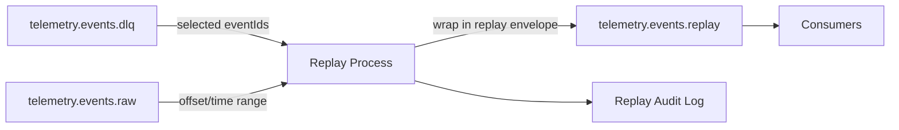

# Event Replay Strategy

## Overview

This document defines the strategy for replaying events in PulseStream. Replay is used to recover from failed event processing or to reprocess historical telemetry after a downstream fix, reusing existing consumer processing logic and topic contracts (consumers do need to subscribe to the new replay topic — see [Alignment with Architecture](#alignment-with-architecture)).

This document covers **strategy and scope only**. Implementation is tracked separately.

---

## Replay Sources

### 1. Dead Letter Queue (`telemetry.events.dlq`)

- Primary replay source.
- Contains events that failed processing after retries were exhausted (see [topics.md](./topics.md), [event-schema.md](./event-schema.md)).
- Replay targets specific failed events by `eventId`.
- Low blast radius — only previously-failed events are affected.

### 2. Raw topic (`telemetry.events.raw`)

- Used for bulk reprocessing: schema migrations, bug fixes in `telemetry-processor` that require reprocessing telemetry that was already handled once.
- Replay targets a time range or offset range rather than individual event IDs.
- Higher blast radius — replays events that already flowed through the system once, so downstream consumers and the `telemetry.events.processed` topic are affected.

---

## Replay Trigger Mechanism

- Replay is **manually triggered** by an operator (CLI or admin endpoint) specifying:
  - source (`dlq` or `raw`)
  - selection (event IDs for DLQ, offset/time range for raw)
  - target topic
- There is no automatic retry loop from the DLQ. Keeping replay manual bounds the blast radius and keeps a human in the loop for bulk raw-topic replays.
- Replayed events are published to a dedicated `telemetry.events.replay` topic rather than directly back into `telemetry.events.raw`, so replayed traffic stays distinguishable from live traffic.
- Each replayed event carries additional envelope metadata (in addition to the standard envelope defined in [event-schema.md](./event-schema.md)):

| Field            | Description                                  |
|------------------|-----------------------------------------------|
| `replay`         | `true` — marks the event as a replay          |
| `originalEventId`| `eventId` of the event being replayed         |
| `replayedAt`     | Timestamp the replay was triggered            |

### Replay Event Identity and Idempotency

`telemetry-processor` persists processed events to the `processed_telemetry` table with a unique
constraint on `event_id` (see `ProcessedTelemetryPersistenceService`). A duplicate `event_id` insert
is treated as a no-op — this is intentional, existing behavior that makes at-least-once Kafka
redelivery of the *same* event idempotent.

That behavior would silently defeat raw-topic replay if a replayed event reused its original
`eventId`: a raw-topic replay targets events that were **already processed and persisted once**, so
re-publishing under the same `eventId` would hit the unique constraint and be skipped as a "duplicate"
— even though the intent is to reprocess it (e.g. after a bug fix) and persist a new result.

To avoid this, every replayed event is assigned a **new `eventId`** when it is wrapped in the replay
envelope. `originalEventId` preserves the lineage back to the source event for audit/traceability, but
`eventId` itself is always fresh. This keeps the rule uniform for both sources:

- **DLQ-sourced replays**: the original event failed processing and was never persisted, so reusing
  its `eventId` would normally be safe. A new `eventId` is still assigned for consistency, and so that
  replaying the same DLQ event twice doesn't silently no-op if the first replay attempt succeeded.
- **Raw-topic replays**: the original event was already persisted under its own `eventId`. A new
  `eventId` is required so the reprocessed result is stored as a new row rather than skipped by the
  existing unique-constraint no-op path.

---

## Replay Flow

1. Operator selects a source: DLQ (specific `eventId`s) or raw topic (offset/time range).
2. The replay process reads the matching records from the source topic.
3. Each record is wrapped in a replay envelope (original envelope + replay metadata above, including a
   freshly generated `eventId` per [Replay Event Identity and Idempotency](#replay-event-identity-and-idempotency)).
4. The wrapped record is published to `telemetry.events.replay`.
5. `telemetry-processor` subscribes to `telemetry.events.replay` using the same processing logic it
   already applies to `telemetry.events.raw`, for both DLQ-sourced and raw-sourced replays.
   `query-service` is listed as a **planned** consumer of `telemetry.events.processed` and
   `telemetry.events.anomalies` (see [topics.md](./topics.md)); it does not consume from Kafka today,
   so it is not part of the replay consumption path yet.
6. Each replay run is logged: source, selection criteria, record count, initiator, and timestamp — for audit and troubleshooting.

---

## Alignment with Architecture

- Reuses the existing Kafka topic and consumer-group model documented in [topics.md](./topics.md).
  Processing/handler logic is unchanged — `telemetry-processor` applies the same normalization and
  anomaly-detection logic it already runs against `telemetry.events.raw`. The one required change is
  topic subscription: `telemetry-processor` must additionally subscribe to `telemetry.events.replay`.
- Reuses the existing DLQ (`telemetry.events.dlq`) as the primary failure-recovery source rather than introducing a new failure-handling mechanism.
- Follows the standard event envelope from [event-schema.md](./event-schema.md), extended with replay-specific metadata rather than a separate schema.

---

## Out of Scope

- Implementation of the replay process/service.
- Automatic retry policies from the DLQ.
- Replay tooling UI.
