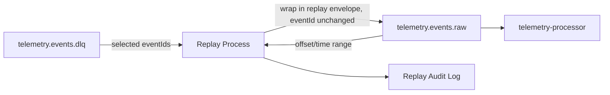

# Event Replay Strategy

## Overview

This document defines the strategy for replaying events in PulseStream. Replay is used to recover from failed event processing or to reprocess historical telemetry after a downstream fix, reusing the existing `telemetry.events.raw` topic and consumer rather than introducing new infrastructure (see [Alignment with Architecture](#alignment-with-architecture)).

This document covers **strategy and scope only**. Implementation is tracked separately, including #124 (republishing replayed events to `telemetry.events.raw`).

---

## Replay Sources

### 1. Dead Letter Queue (`telemetry.events.dlq`)

- Primary replay source.
- Contains events that failed processing after retries were exhausted (see [topics.md](./topics.md), [event-schema.md](./event-schema.md)).
- Replay targets specific failed events by `eventId`.
- Low blast radius — only previously-failed events are affected.

### 2. Raw topic (`telemetry.events.raw`)

- Used for bulk reprocessing: schema migrations, bug fixes in `telemetry-processor` that require reprocessing telemetry that was already handled once.
- Replay targets a time range or offset range rather than individual event IDs.
- Higher blast radius — replays events that already flowed through the system once, so downstream consumers and the `telemetry.events.processed` topic are affected.

---

## Replay Trigger Mechanism

- Replay is **manually triggered** by an operator (CLI or admin endpoint) specifying:
  - source (`dlq` or `raw`)
  - selection (event IDs for DLQ, offset/time range for raw)
- There is no automatic retry loop from the DLQ. Keeping replay manual bounds the blast radius and keeps a human in the loop for bulk raw-topic replays.
- Replayed events are published back to **`telemetry.events.raw`** — the same topic they originated from (directly, for raw-sourced replay, or after being read out of the DLQ, for DLQ-sourced replay). This matches #124's scope ("publish events back to `telemetry.events.raw`") and avoids introducing a topic that isn't defined in [topics.md](./topics.md) or provisioned anywhere. There is no separate `telemetry.events.replay` topic.
- Each replayed event carries additional envelope metadata (in addition to the standard envelope defined in [event-schema.md](./event-schema.md)):

| Field        | Description                                  |
|--------------|-----------------------------------------------|
| `replay`     | `true` — marks the event as a replay          |
| `replayedAt` | Timestamp the replay was triggered            |

`eventId` is **not** regenerated for a replay — see below.

### Replay Event Identity and Idempotency

`telemetry-processor` currently persists processed events to the `processed_telemetry` table with a
unique constraint on `event_id` (see `ProcessedTelemetryPersistenceService`), and a duplicate insert
is skipped as a no-op. That skip-on-duplicate behavior is correct for ordinary at-least-once Kafka
redelivery of the *same* event, but replay has a different goal: a raw-topic replay is meant to
**produce a corrected result for an event that already has one**, not to create a second, unrelated
result next to the first.

**Rule: a replayed event always keeps the `eventId` of the event it replays.** No new `eventId` is
minted, and no separate `originalEventId` field is needed, because `eventId` itself never changes.
This has two consequences, one per source:

- **DLQ-sourced replay**: the original event failed before it was ever persisted (DLQ events never
  reached `processed_telemetry`). Reprocessing it under its original `eventId` is a plain insert — no
  prior row exists to conflict with.
- **Raw-topic replay**: the original event *was* already persisted under this `eventId`. For the
  reprocessed result to replace it rather than being silently dropped, persistence must **upsert by
  `event_id`** (insert-or-replace) instead of skip-on-duplicate. This is a behavior change from
  today's skip-on-duplicate logic, and is **scoped to a follow-up implementation issue** — it is not
  part of this strategy doc or of #123/#124.

This also answers the "replaying the same source twice" case: because the `eventId` is always the
original one, re-triggering a replay of the same event upserts the same row again rather than creating
an additional row — the persisted state converges to the latest replay's result instead of
accumulating duplicates. Downstream topics (`telemetry.events.processed`, `telemetry.events.anomalies`)
will still emit one message per replay execution, same as any reprocessing run; that is expected
audit/observability behavior, not a duplicate-state problem, since consumers of those topics are
expected to key off `eventId` the same way `processed_telemetry` does.

---

## Replay Flow

1. Operator selects a source: DLQ (specific `eventId`s) or raw topic (offset/time range).
2. The replay process reads the matching records from the source topic.
3. Each record is wrapped in a replay envelope (original envelope, unchanged `eventId`, plus the
   `replay`/`replayedAt` metadata above).
4. The wrapped record is published back to `telemetry.events.raw`.
5. `telemetry-processor` consumes it through its **existing** subscription to `telemetry.events.raw` —
   no new topic subscription or listener is required, for either DLQ-sourced or raw-sourced replays.
   `query-service` is listed as a **planned** consumer of `telemetry.events.processed` and
   `telemetry.events.anomalies` (see [topics.md](./topics.md)); it does not consume from Kafka today,
   so it is not part of the replay consumption path yet.
6. Persistence upserts by `event_id` rather than skipping the duplicate (see
   [Replay Event Identity and Idempotency](#replay-event-identity-and-idempotency)); this persistence
   change is tracked as a follow-up implementation issue.
7. Each replay run is logged: source, selection criteria, record count, initiator, and timestamp — for audit and troubleshooting.

---

## Alignment with Architecture

- Reuses the existing `telemetry.events.raw` topic and `telemetry-processor` consumer group documented
  in [topics.md](./topics.md) — no new topic, no new subscription, no processing-logic change.
- Reuses the existing DLQ (`telemetry.events.dlq`) as the primary failure-recovery source rather than introducing a new failure-handling mechanism.
- Follows the standard event envelope from [event-schema.md](./event-schema.md), extended with replay-specific metadata rather than a separate schema.
- Depends on a persistence-layer change (upsert-by-`event_id` instead of skip-on-duplicate) to make
  raw-topic replay actually supersede the prior result; tracked as a follow-up implementation issue,
  not part of this strategy doc.

---

## Out of Scope

- Implementation of the replay process/service.
- Implementation of the upsert-by-`event_id` persistence change.
- Automatic retry policies from the DLQ.
- Replay tooling UI.
