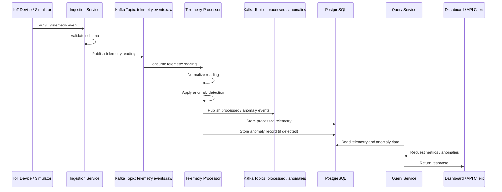

# Event Flow Diagram

This diagram illustrates the lifecycle of a telemetry event as it moves through the PulseStream platform.

**Notes:**

*   The platform receives telemetry over HTTP through the ingestion service.
*   Kafka decouples telemetry producers from downstream consumers.
*   The telemetry processor applies anomaly detection rules asynchronously.
*   The processor publishes results to output topics (`telemetry.events.processed`, `telemetry.events.anomalies`) before persisting to PostgreSQL.
*   Processed results are stored in PostgreSQL and later exposed through query APIs.
