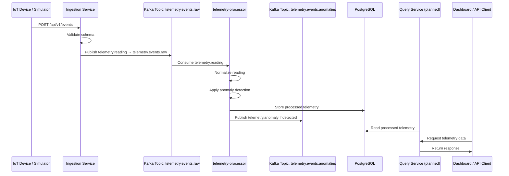

# Event Flow Diagram

This diagram illustrates the lifecycle of a telemetry event as it moves through the PulseStream platform.

**Notes:**

*   The platform receives telemetry over HTTP through the ingestion service.
*   Kafka decouples telemetry producers from downstream consumers.
*   The telemetry-processor applies anomaly detection rules asynchronously.
*   Normal processed telemetry is stored in PostgreSQL.
*   Anomaly events are currently published to Kafka; database anomaly persistence and query APIs are planned.
