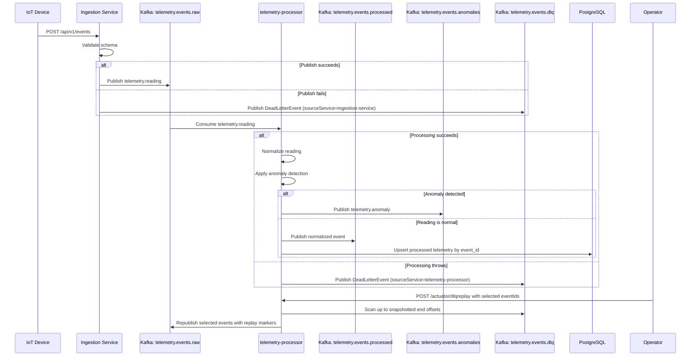

# Event Flow Diagram

This diagram illustrates the lifecycle of a telemetry event as it moves through the PulseStream platform, including the failure and replay paths.

```mermaid
sequenceDiagram
    participant Device as IoT Device
    participant Ingestion as Ingestion Service
    participant Raw as Kafka: telemetry.events.raw
    participant Processor as telemetry-processor
    participant Processed as Kafka: telemetry.events.processed
    participant Anomalies as Kafka: telemetry.events.anomalies
    participant DLQ as Kafka: telemetry.events.dlq
    participant DB as PostgreSQL
    participant Operator as Operator

    Device->>Ingestion: POST /api/v1/events
    Ingestion->>Ingestion: Validate schema
    alt Publish succeeds
        Ingestion->>Raw: Publish telemetry.reading
    else Publish fails
        Ingestion->>DLQ: Publish DeadLetterEvent (sourceService=ingestion-service)
    end

    Raw->>Processor: Consume telemetry.reading
    alt Processing succeeds
        Processor->>Processor: Normalize reading
        Processor->>Processor: Apply anomaly detection
        alt Anomaly detected
            Processor->>Anomalies: Publish telemetry.anomaly
        else Reading is normal
            Processor->>Processed: Publish normalized event
            Processor->>DB: Upsert processed telemetry by event_id
        end
    else Processing throws
        Processor->>DLQ: Publish DeadLetterEvent (sourceService=telemetry-processor)
    end

    Operator->>Processor: POST /actuator/dlqreplay with selected eventIds
    Processor->>DLQ: Scan up to snapshotted end offsets
    Processor->>Raw: Republish selected events with replay markers
```

**Notes:**

*   The platform receives telemetry over HTTP through the ingestion service; Kafka decouples producers from downstream consumers.
*   **Both** services write to the dead-letter topic. The record is a `DeadLetterEvent` wrapper carrying the original event plus error metadata and the `sourceService` that produced it.
*   The processor has no retry policy on its listener container: a processing failure dead-letters on the first attempt, so a processor-sourced record means "failed once", not "retries exhausted".
*   The two outcomes are exclusive. A **normal** reading is published to `telemetry.events.processed` and persisted; an **anomalous** reading is published to `telemetry.events.anomalies` only — it is neither persisted nor republished as processed telemetry. Anomaly persistence is planned (#267).
*   Replay is manual and selective. Only the `eventId` values an operator supplies are republished; every other dead-letter record read during the scan is skipped, and the run is bounded by per-partition end offsets captured when it was triggered. Replayed events carry markers so persistence stays idempotent. See [event-replay-strategy.md](../architecture/event-replay-strategy.md).
*   Reading processed telemetry back out of the database is not implemented: `query-service` is a scaffold and the query API is planned (#266).
