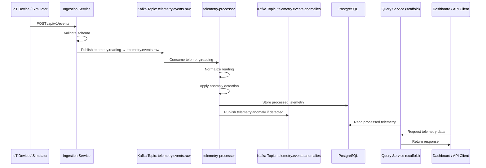

# Event Flow Diagram

This diagram illustrates the lifecycle of a telemetry event as it moves through the PulseStream platform.

```mermaid
sequenceDiagram
    participant Device as IoT Device / Simulator
    participant Ingestion as Ingestion Service
    participant Kafka as Kafka Topic: telemetry.events.raw
    participant Processor as telemetry-processor
    participant Anomalies as Kafka Topic: telemetry.events.anomalies
    participant DB as PostgreSQL
    participant Query as Query Service (scaffold)
    participant Dashboard as Dashboard / API Client

    Device->>Ingestion: POST /api/v1/events
    Ingestion->>Ingestion: Validate schema
    Ingestion->>Kafka: Publish telemetry.reading → telemetry.events.raw
    Kafka->>Processor: Consume telemetry.reading
    Processor->>Processor: Normalize reading
    Processor->>Processor: Apply anomaly detection
    Processor->>DB: Store processed telemetry
    Processor->>Anomalies: Publish telemetry.anomaly if detected
    Query->>DB: Read processed telemetry
    Dashboard->>Query: Request telemetry data
    Query->>Dashboard: Return response
```

**Notes:**

*   The platform receives telemetry over HTTP through the ingestion service.
*   Kafka decouples telemetry producers from downstream consumers.
*   The telemetry-processor applies anomaly detection rules asynchronously.
*   Normal processed telemetry is stored in PostgreSQL.
*   Events that fail processing are routed to `telemetry.events.dlq` and can be replayed back into the pipeline via a management endpoint on the telemetry processor.
*   Anomaly events are currently published to Kafka only; application-level anomaly persistence and the query APIs are Phase 7 work (the `query-service` is a scaffold).
