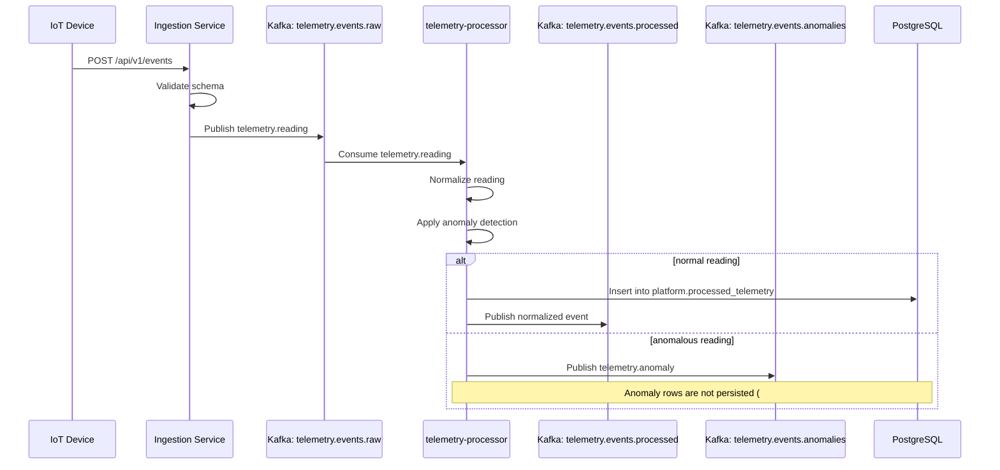
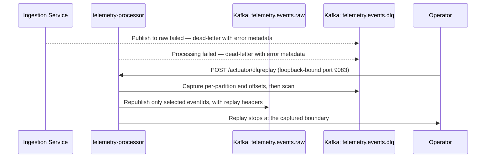

# Event Flow Diagram

This diagram illustrates the lifecycle of a telemetry event as it moves through the PulseStream platform.

Status words follow [`PROJECT_STATE.md`](../../PROJECT_STATE.md#how-to-read-status-in-this-repository).

## Successful path

```mermaid
sequenceDiagram
    participant Device as IoT Device
    participant Ingestion as Ingestion Service
    participant Raw as Kafka: telemetry.events.raw
    participant Processor as telemetry-processor
    participant Processed as Kafka: telemetry.events.processed
    participant Anomalies as Kafka: telemetry.events.anomalies
    participant DB as PostgreSQL

    Device->>Ingestion: POST /api/v1/events
    Ingestion->>Ingestion: Validate schema
    Ingestion->>Raw: Publish telemetry.reading
    Raw->>Processor: Consume telemetry.reading
    Processor->>Processor: Normalize reading
    Processor->>Processor: Apply anomaly detection
    alt normal reading
        Processor->>DB: Insert into platform.processed_telemetry
        Processor->>Processed: Publish normalized event
    else anomalous reading
        Processor->>Anomalies: Publish telemetry.anomaly
        Note over Processor,DB: Anomaly rows are not persisted (#267)
    end
```

## Failure and replay path

```mermaid
sequenceDiagram
    participant Ingestion as Ingestion Service
    participant Processor as telemetry-processor
    participant Raw as Kafka: telemetry.events.raw
    participant Dlq as Kafka: telemetry.events.dlq
    participant Operator as Operator

    Ingestion-->>Dlq: Publish to raw failed — dead-letter with error metadata
    Processor-->>Dlq: Processing failed — dead-letter with error metadata

    Operator->>Processor: POST /actuator/dlqreplay (loopback-bound port 9083)
    Processor->>Dlq: Capture per-partition end offsets, then scan
    Processor->>Raw: Republish only selected eventIds, with replay headers
    Processor->>Operator: Replay stops at the captured boundary
```

**Notes:**

*   The platform receives telemetry over HTTP through the ingestion service. Ingestion is unauthenticated and unencrypted today ([#273](https://github.com/ME-Massine/pulsestream/issues/273)).
*   Kafka decouples telemetry producers from downstream consumers.
*   The telemetry-processor applies anomaly detection rules asynchronously. Detection state is per-replica, so results depend on how events are partitioned across replicas ([#269](https://github.com/ME-Massine/pulsestream/issues/269)).
*   Only normal processed telemetry is stored in PostgreSQL. Anomaly events are published to Kafka; the `platform.anomalies` table exists in the schema script but no application code writes to it.
*   **Dead-letter routing and replay are implemented** and validated under Docker Compose by [`scripts/validate-dlq-pipeline.ps1`](../../scripts/validate-dlq-pipeline.ps1) and [`scripts/validate-event-replay.ps1`](../../scripts/validate-event-replay.ps1). Replay is selective: a `start` request without a non-empty `eventId` selection is rejected, and unselected records are never replayed automatically. Full semantics are in [`../architecture/event-replay-strategy.md`](../architecture/event-replay-strategy.md).
*   The Kafka publish and the PostgreSQL write are separate operations and are not atomic ([#270](https://github.com/ME-Massine/pulsestream/issues/270)); replayed events are reprocessed without reclassification guarantees ([#271](https://github.com/ME-Massine/pulsestream/issues/271)).
*   `telemetry.events.processed` and `telemetry.events.anomalies` have no committed consumer. Query access is planned ([#266](https://github.com/ME-Massine/pulsestream/issues/266), [#267](https://github.com/ME-Massine/pulsestream/issues/267)).
*   Both the ingestion and processing hops are traced. W3C `tracecontext` propagates over HTTP, and each service emits `trace_id` and `span_id` in its logs.
