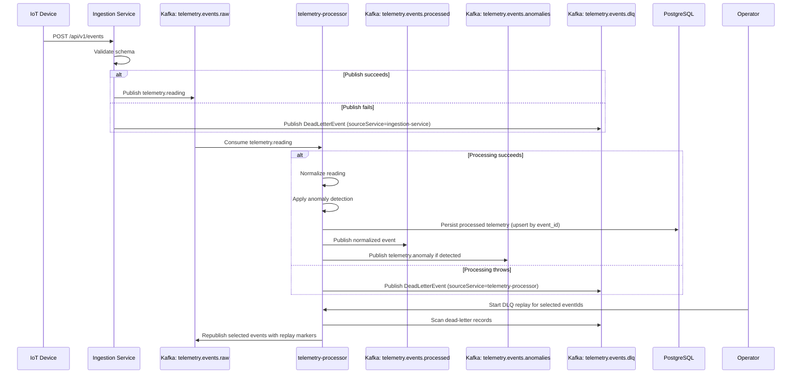

# Event Flow Diagram

This diagram illustrates the lifecycle of a telemetry event as it moves through the PulseStream platform, including the failure path.

```mermaid
sequenceDiagram
    participant Device as IoT Device
    participant Ingestion as Ingestion Service
    participant Raw as Kafka: telemetry.events.raw
    participant Processor as telemetry-processor
    participant Processed as Kafka: telemetry.events.processed
    participant Anomalies as Kafka: telemetry.events.anomalies
    participant Dlq as Kafka: telemetry.events.dlq
    participant DB as PostgreSQL
    participant Operator as Operator

    Device->>Ingestion: POST /api/v1/events
    Ingestion->>Ingestion: Validate schema
    alt Publish succeeds
        Ingestion->>Raw: Publish telemetry.reading
    else Publish fails
        Ingestion->>Dlq: Publish DeadLetterEvent (sourceService=ingestion-service)
    end

    Raw->>Processor: Consume telemetry.reading
    alt Processing succeeds
        Processor->>Processor: Normalize reading
        Processor->>Processor: Apply anomaly detection
        Processor->>DB: Persist processed telemetry (upsert by event_id)
        Processor->>Processed: Publish normalized event
        Processor->>Anomalies: Publish telemetry.anomaly if detected
    else Processing throws
        Processor->>Dlq: Publish DeadLetterEvent (sourceService=telemetry-processor)
    end

    Operator->>Processor: Start DLQ replay for selected eventIds
    Processor->>Dlq: Scan dead-letter records
    Processor->>Raw: Republish selected events with replay markers
```

**Notes:**

*   The platform receives telemetry over HTTP through the ingestion service.
*   Kafka decouples telemetry producers from downstream consumers.
*   The telemetry-processor applies anomaly detection rules asynchronously.
*   Normal processed telemetry is persisted to PostgreSQL. The raw record is not acknowledged until the projection is stored, and the write is idempotent on `event_id`.
*   The processor has **no retry policy** on its listener container: a processing failure goes to the dead-letter queue on the first attempt. Recovery is by replay, not by automatic retry.
*   Replay is manual and selective. Only `eventId`s the operator supplies are republished; every other dead-letter record scanned is skipped. A replayed event carries replay markers and its projection replaces the existing row rather than duplicating it. See [event-replay-strategy.md](../architecture/event-replay-strategy.md).

**Not shown, because it does not exist yet:**

*   Anomaly persistence — anomaly events reach Kafka only ([#267](https://github.com/ME-Massine/pulsestream/issues/267)).
*   A query path from PostgreSQL to API clients — `query-service` is a scaffold ([#266](https://github.com/ME-Massine/pulsestream/issues/266)).
