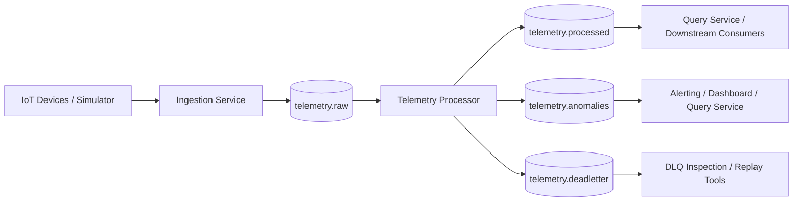

# Kafka Topology Diagram

This diagram shows how PulseStream uses Kafka topics to decouple producers and consumers across the telemetry pipeline.

### Topic Definitions

| Topic                | Producer                                | Consumer                                  | Purpose                           |
|----------------------|-----------------------------------------|-------------------------------------------|-----------------------------------|
| `telemetry.raw`      | Ingestion Service                       | Telemetry Processor                       | Raw incoming telemetry events     |
| `telemetry.processed`| Telemetry Processor                     | Query Service / downstream consumers      | Normalized and enriched telemetry data |
| `telemetry.anomalies`| Telemetry Processor                     | Dashboard / alerting / query service      | Detected anomaly events           |
| `telemetry.deadletter`| Ingestion Service or Telemetry Processor | Replay or inspection tools                | Invalid or failed events          |

### Notes

*   `telemetry.raw` is the primary ingestion topic.
*   `telemetry.processed` allows downstream consumers to use cleaned telemetry without duplicating processing logic.
*   `telemetry.anomalies` isolates anomaly events from normal telemetry flow.
*   `telemetry.deadletter` supports resilience and recovery workflows.
