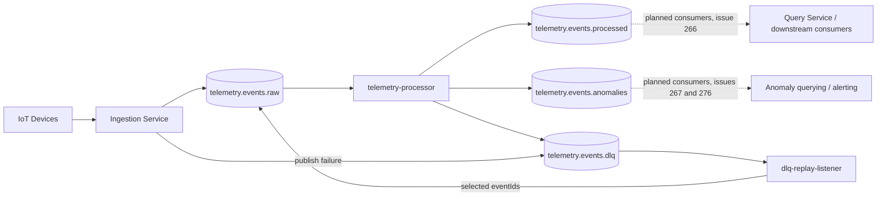

# Kafka Topology Diagram

This diagram shows how PulseStream uses Kafka topics to decouple producers and consumers across the telemetry pipeline.

```mermaid
flowchart LR
    A[IoT Devices] --> B[Ingestion Service]
    B --> T1[(telemetry.events.raw)]

    T1 --> C[telemetry-processor]

    C --> T2[(telemetry.events.processed)]
    C --> T3[(telemetry.events.anomalies)]
    C --> T4[(telemetry.events.dlq)]
    B -- publish failure --> T4

    T4 --> R[dlq-replay-listener]
    R -- selected eventIds --> T1

    T2 -. planned consumers, issue 266 .-> D[Query Service / downstream consumers]
    T3 -. planned consumers, issues 267 and 276 .-> E[Anomaly querying / alerting]
```

### Topic Definitions

| Topic | Producer | Consumer | Purpose |
|---|---|---|---|
| `telemetry.events.raw` | `ingestion-service`; `telemetry-processor` when replaying | `telemetry-processor` | Accepted telemetry events, and the replay target |
| `telemetry.events.processed` | `telemetry-processor` | None yet — planned query service and downstream consumers (#266) | Normalized telemetry |
| `telemetry.events.anomalies` | `telemetry-processor` | None yet — planned anomaly persistence and alerting (#267, #276) | Detected anomaly events |
| `telemetry.events.dlq` | `ingestion-service` and `telemetry-processor` | `telemetry-processor` `dlq-replay-listener`, started on demand | Failed events, with error metadata |

### Configuration

Both environments provision the same four topics with different durability settings: the Compose stack runs a single broker at replication factor 1 (`infrastructure/docker/kafka/init-topics.sh`), and Kubernetes runs three brokers at replication factor 3 with `min.insync.replicas=2`, declared as Strimzi `KafkaTopic` resources (`infrastructure/kubernetes/kafka/topics.yaml`). Per-topic partitions and retention are in [topics.md](../architecture/topics.md).

### Notes

*   `telemetry.events.raw` is both the ingestion topic and the replay target. Because DLQ replay republishes into it, replay runs are bounded by end offsets snapshotted at trigger time so a run cannot consume its own output.
*   `telemetry.events.processed` lets downstream consumers use cleaned telemetry without duplicating processing logic. No consumer subscribes to it yet.
*   `telemetry.events.anomalies` isolates anomaly events from the normal telemetry flow. Nothing consumes or persists them yet (#267).
*   `telemetry.events.dlq` is in active use, not reserved for the future: both services write to it, and the `dlq-replay-listener` reads from it under its own consumer group when an operator triggers a replay. It is otherwise idle — the listener is registered with `autoStartup=false`.
