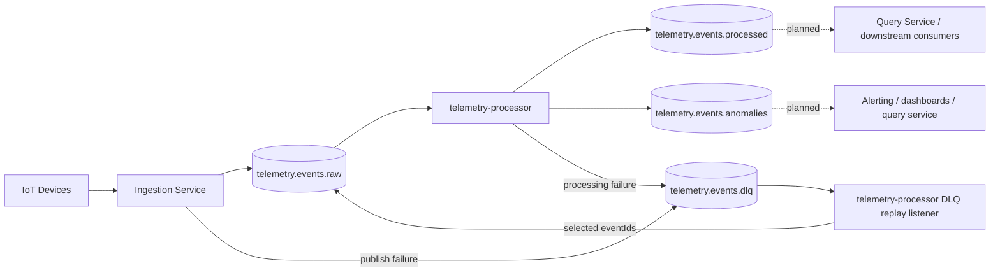

# Kafka Topology Diagram

This diagram shows how PulseStream uses Kafka topics to decouple producers and consumers across the telemetry pipeline.

Solid edges are implemented. Dashed edges are planned. Status words follow [`PROJECT_STATE.md`](../../PROJECT_STATE.md#how-to-read-status-in-this-repository).

```mermaid
flowchart LR
    A[IoT Devices] --> B[Ingestion Service]
    B --> T1[(telemetry.events.raw)]

    T1 --> C[telemetry-processor]

    C --> T2[(telemetry.events.processed)]
    C --> T3[(telemetry.events.anomalies)]

    B -->|publish failure| T4[(telemetry.events.dlq)]
    C -->|processing failure| T4

    T4 --> R[telemetry-processor DLQ replay listener]
    R -->|selected eventIds| T1

    T2 -. planned .-> D[Query Service / downstream consumers]
    T3 -. planned .-> E[Alerting / dashboards / query service]
```

### Topic Definitions

| Topic | Producer | Consumer | Purpose |
| :--- | :--- | :--- | :--- |
| `telemetry.events.raw` | Ingestion Service; telemetry-processor replay listener | telemetry-processor | Raw incoming telemetry events |
| `telemetry.events.processed` | telemetry-processor | None committed — query service and downstream consumers are planned | Normalized and enriched telemetry data |
| `telemetry.events.anomalies` | telemetry-processor | None committed — dashboards, alerting and query service are planned | Detected anomaly events |
| `telemetry.events.dlq` | Ingestion Service (publish failures); telemetry-processor (processing failures) | telemetry-processor DLQ replay listener, in its own consumer group | Failed events, enriched with error metadata |

### Consumer Groups

| Group | Topic | Purpose |
| :--- | :--- | :--- |
| `telemetry-processor` | `telemetry.events.raw` | The main processing path. Concurrency defaults to 1, so replica count is capped by the topic's partition count. |
| `telemetry-processor-dlq-replay` | `telemetry.events.dlq` | Bounded replay. Started on demand by the `dlqreplay` actuator endpoint; stops at the per-partition end offsets captured when replay was triggered, with an idle-timeout fallback. |

### Notes

*   `telemetry.events.raw` is the primary ingestion topic and the target of replay, so the processor sees replayed events on its normal path.
*   `telemetry.events.processed` allows downstream consumers to use cleaned telemetry without duplicating processing logic. It has no consumer yet.
*   `telemetry.events.anomalies` isolates anomaly events from normal telemetry flow. It has no consumer yet, and anomaly events are not persisted.
*   **`telemetry.events.dlq` is in active use.** Both platform services produce to it on failure, and the processor's replay listener consumes it. See [`../architecture/event-replay-strategy.md`](../architecture/event-replay-strategy.md) for replay bounds, headers, and the duplicate-delivery contract that consumers of `processed` and `anomalies` will have to honour.
*   Under Docker Compose the topics are created by [`infrastructure/docker/kafka/init-topics.sh`](../../infrastructure/docker/kafka/init-topics.sh); on Kubernetes they are declared as Strimzi `KafkaTopic` resources in [`infrastructure/kubernetes/kafka/topics.yaml`](../../infrastructure/kubernetes/kafka/topics.yaml).
*   Kafka client traffic is neither authenticated nor encrypted ([#275](https://github.com/ME-Massine/pulsestream/issues/275)).
