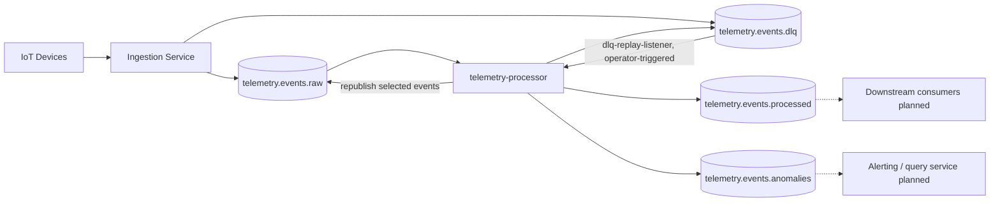

# Kafka Topology Diagram

This diagram shows how PulseStream uses Kafka topics to decouple producers and consumers across the telemetry pipeline.

```mermaid
flowchart LR
    A[IoT Devices] --> B[Ingestion Service]
    B --> T1[(telemetry.events.raw)]
    B --> T4[(telemetry.events.dlq)]

    T1 --> C[telemetry-processor]

    C --> T2[(telemetry.events.processed)]
    C --> T3[(telemetry.events.anomalies)]
    C --> T4

    T4 -->|dlq-replay-listener, operator-triggered| C
    C -->|republish selected events| T1

    T2 -.-> D[Downstream consumers planned]
    T3 -.-> E[Alerting / query service planned]
```

### Topic Definitions

| Topic | Producer | Consumer | Purpose |
| :--- | :--- | :--- | :--- |
| `telemetry.events.raw` | ingestion-service; telemetry-processor during replay | telemetry-processor | Raw incoming telemetry events |
| `telemetry.events.processed` | telemetry-processor | None yet — planned query service and downstream consumers | Normalized and enriched telemetry |
| `telemetry.events.anomalies` | telemetry-processor | None yet — planned alerting and query consumers | Detected anomaly events |
| `telemetry.events.dlq` | ingestion-service and telemetry-processor | telemetry-processor's `dlq-replay-listener`, and manual inspection | Failed events, wrapped with error metadata |

Replication factors differ by environment: the Kubernetes topics are provisioned as `KafkaTopic` resources at replication factor 3 with `min.insync.replicas=2`, while the single-broker local stack provisions the same topics at replication factor 1. See [topics.md](../architecture/topics.md).

### Notes

*   `telemetry.events.raw` is the primary ingestion topic and also the replay target, so a replayed event re-enters the pipeline through the same consumer as an original one.
*   `telemetry.events.processed` allows downstream consumers to use cleaned telemetry without duplicating processing logic. Nothing consumes it today.
*   `telemetry.events.anomalies` isolates anomaly events from the normal telemetry flow. Nothing consumes it today, and anomalies are not persisted ([#267](https://github.com/ME-Massine/pulsestream/issues/267)).
*   `telemetry.events.dlq` is an active failure path, not a reserved one. Both services write to it, and its records are replayed selectively through an operator-triggered actuator endpoint on `telemetry-processor` — see [event-replay-strategy.md](../architecture/event-replay-strategy.md).
