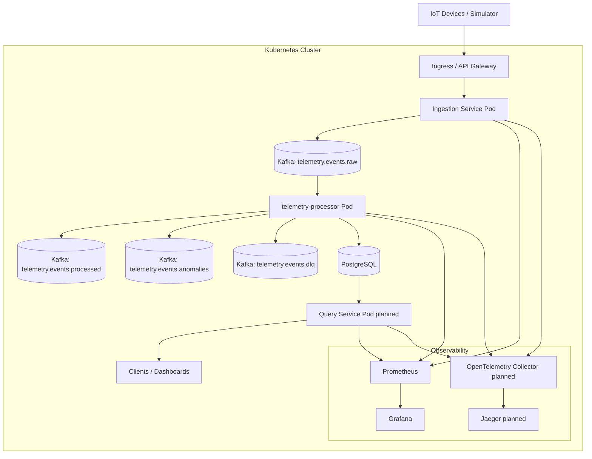

# Kubernetes Deployment Diagram

This planned diagram shows how PulseStream components are intended to be deployed inside a Kubernetes cluster. Kubernetes manifests are not present in the current checkout.

**Notes:**

*   External telemetry would enter through an ingress or API gateway.
*   Each service would run as one or more pods and scale independently.
*   Kafka remains the intended asynchronous backbone inside the cluster.
*   Prometheus metrics collection is already part of the local design; OpenTelemetry tracing is planned.
*   PostgreSQL provides durable storage for processed telemetry. Anomaly persistence is planned.
