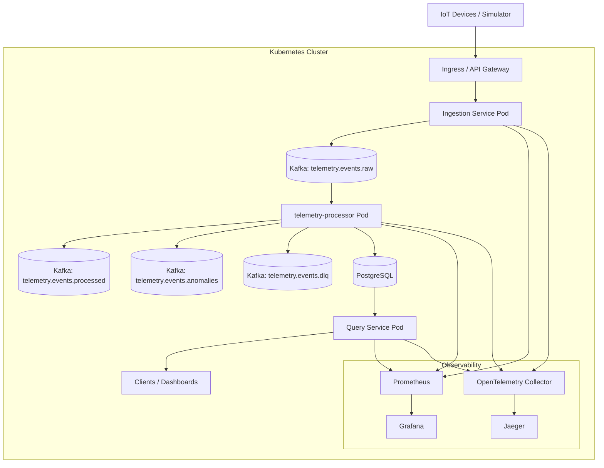

# Kubernetes Deployment Diagram

This diagram shows how PulseStream components are deployed inside a Kubernetes cluster.

**Notes:**

*   External telemetry enters through an ingress or API gateway.
*   Each service runs as one or more pods and can scale independently.
*   Kafka remains the asynchronous backbone inside the cluster.
*   Prometheus and OpenTelemetry collect metrics and traces from all services.
*   PostgreSQL provides durable storage for processed telemetry and anomalies.
