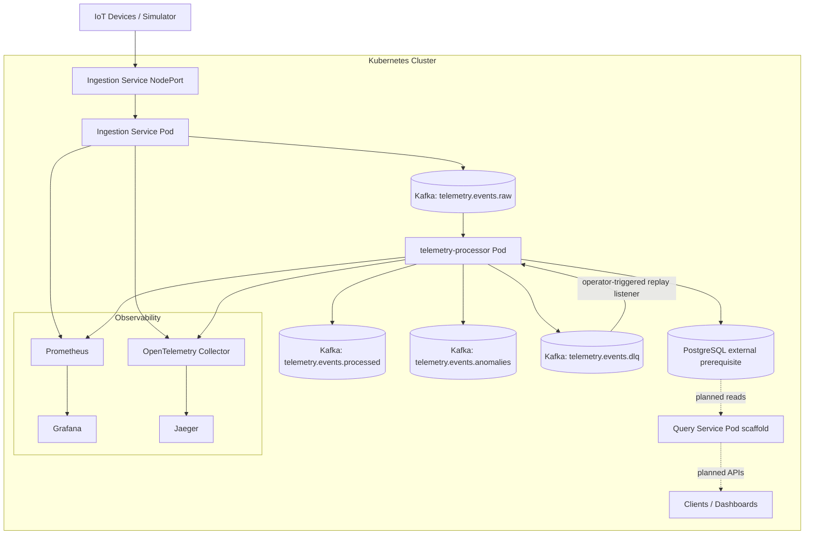

# Kubernetes Deployment Diagram

This diagram shows how PulseStream components are deployed inside a Kubernetes cluster. Manifests are committed under [`infrastructure/kubernetes/`](../../infrastructure/kubernetes/) for the platform services, Kafka (via the Strimzi operator), in-cluster observability, autoscaling, and network policies. PostgreSQL must currently be supplied separately, and full-platform end-to-end validation against a live target cluster remains Phase 7 work.

```mermaid
flowchart TB
    U[IoT Devices / Simulator] --> I[Ingestion Service NodePort]

    subgraph Kubernetes Cluster
        I --> S1[Ingestion Service Pod]
        S1 --> K1[(Kafka: telemetry.events.raw)]

        K1 --> S2[telemetry-processor Pod]
        S2 --> K2[(Kafka: telemetry.events.processed)]
        S2 --> K3[(Kafka: telemetry.events.anomalies)]
        S2 --> K4[(Kafka: telemetry.events.dlq)]

        K4 -->|operator-triggered replay listener| S2

        S2 --> DB[(PostgreSQL external prerequisite)]

        DB -.->|planned reads| S3[Query Service Pod scaffold]
        S3 -.->|planned APIs| C[Clients / Dashboards]

        subgraph Observability
            P[Prometheus]
            G[Grafana]
            O[OpenTelemetry Collector]
            J[Jaeger]
        end

        S1 --> P
        S2 --> P

        S1 --> O
        S2 --> O

        P --> G
        O --> J
    end
```

**Notes:**

*   External telemetry currently reaches the cluster through the ingestion-service NodePort (`infrastructure/kubernetes/ingestion-service/service-nodeport.yaml`). Ingress, TLS, and authentication remain planned.
*   Each service runs as one or more pods and scales independently; CPU-based and custom-metrics Horizontal Pod Autoscalers are committed.
*   Kafka is the asynchronous backbone inside the cluster, deployed via the Strimzi operator.
*   Network policies restrict service-to-service traffic to the required paths.
*   Prometheus and Grafana run in the `monitoring` namespace (`infrastructure/kubernetes/monitoring/`). Prometheus was deployed in #154, Grafana in #155, and the Prometheus datasource and dashboards were provisioned in #156.
*   OpenTelemetry tracing runs in the cluster. Services export spans to the collector in the `observability` namespace (#157), which forwards them to the in-cluster Jaeger backend deployed alongside it (#158). Both live in `infrastructure/kubernetes/observability/`.
*   The dead-letter topic (`telemetry.events.dlq`) captures failed events, which the telemetry processor can replay.
*   An externally supplied PostgreSQL workload provides durable storage for processed telemetry. The `query-service` is deployed as a scaffold; query APIs and anomaly persistence are Phase 7 work.
