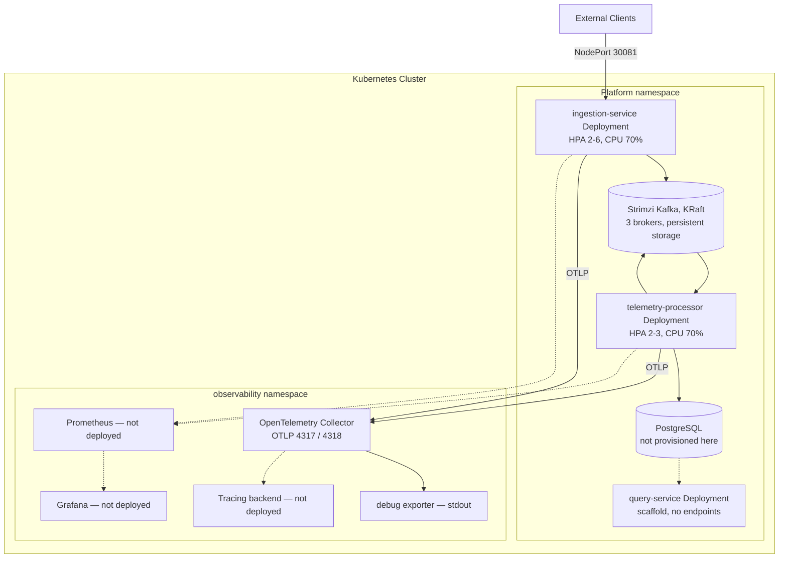

# Kubernetes Deployment Diagram

This diagram shows how PulseStream components are deployed inside a Kubernetes cluster. The manifests are in [`infrastructure/kubernetes/`](../../infrastructure/kubernetes/); each subdirectory has a README with apply order and verification steps.

Solid edges are implemented paths. Dashed edges and dotted nodes are not deployed by these manifests.

```mermaid
flowchart TB
    U[External Clients] -->|NodePort 30081| S1

    subgraph Cluster["Kubernetes Cluster"]
        subgraph Platform["Platform namespace"]
            S1[ingestion-service Deployment<br/>HPA 2-6, CPU 70%]
            S2[telemetry-processor Deployment<br/>HPA 2-3, CPU 70%]
            S3[query-service Deployment<br/>scaffold, no endpoints]

            K[(Strimzi Kafka, KRaft<br/>3 brokers, persistent storage)]
            DB[(PostgreSQL<br/>not provisioned here)]

            S1 --> K
            K --> S2
            S2 --> K
            S2 --> DB
            DB -.-> S3
        end

        subgraph Obs["observability namespace"]
            O[OpenTelemetry Collector<br/>OTLP 4317 / 4318]
            DBG[debug exporter — stdout]
            P[Prometheus — not deployed]
            G[Grafana — not deployed]
            J[Tracing backend — not deployed]
        end

        S1 -->|OTLP| O
        S2 -->|OTLP| O
        O --> DBG
        O -.-> J
        S1 -.-> P
        S2 -.-> P
        P -.-> G
    end
```

**Notes:**

*   **External access** is a NodePort (`30081` to service port `8081`) on `ingestion-service`. There is no Ingress, no TLS, and no authentication in front of it — that is Phase 7 work ([#273](https://github.com/ME-Massine/pulsestream/issues/273)).
*   **Kafka** runs in-cluster under the Strimzi operator in KRaft mode with persistent storage, and its topics are declared as `KafkaTopic` resources. See [ADR 0005](../decisions/0005-kafka-on-kubernetes-with-strimzi.md) and [`infrastructure/kubernetes/kafka/README.md`](../../infrastructure/kubernetes/kafka/README.md).
*   **Autoscaling** is CPU-based for both event-path services. `telemetry-processor`'s ceiling of 3 is the topic partition count, not a capacity guess — extra replicas beyond the partition count would idle. A custom-metrics HPA definition exists for `ingestion-service`, but the consumer-lag series it wants is not exported by anything yet ([#272](https://github.com/ME-Massine/pulsestream/issues/272)). Autoscaling behaviour is validated end to end — see [autoscaling-validation.md](../architecture/autoscaling-validation.md).
*   **NetworkPolicies** deny by default and open only the required paths per service: `telemetry-processor` reaches Kafka, Postgres `:5432`, DNS, and the collector; `query-service` gets DNS only, since it has no backend. See [`infrastructure/kubernetes/network-policies/README.md`](../../infrastructure/kubernetes/network-policies/README.md).
*   **Tracing** reaches the collector from both instrumented services, then stops. The pipeline ends in a `debug` exporter because no trace backend runs in the cluster; pointing an `otlp` exporter at a Service that does not exist would leave the collector retrying and queueing every batch. When the backend lands ([#158](https://github.com/ME-Massine/pulsestream/issues/158)), the change is confined to the collector ConfigMap.
*   **PostgreSQL is not provisioned by these manifests.** `telemetry-processor` is configured for `postgres:5432` in its namespace and the NetworkPolicy opens that port, but no manifest here creates the workload.
*   **Prometheus and Grafana are not deployed in-cluster** ([#154](https://github.com/ME-Massine/pulsestream/issues/154), [#155](https://github.com/ME-Massine/pulsestream/issues/155), [#156](https://github.com/ME-Massine/pulsestream/issues/156)). Metrics endpoints are exposed by the services; nothing scrapes them inside the cluster yet.
*   **`query-service` is deployed but empty.** Its Deployment, Service, and ConfigMap exist so the read side has a place to land; the application has no endpoints and no datasource ([#266](https://github.com/ME-Massine/pulsestream/issues/266)).
