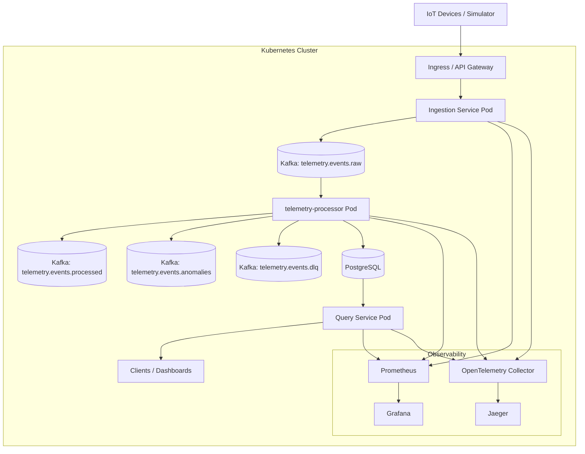

# Kubernetes Deployment Diagram

This diagram shows how PulseStream components are deployed inside a Kubernetes cluster. The service, Kafka, autoscaling, NetworkPolicy, monitoring, and observability manifests live under `infrastructure/kubernetes/`.

```mermaid
flowchart TB
    U[IoT Devices / Simulator] --> I[Ingress / API Gateway]

    subgraph Kubernetes Cluster
        I --> S1[Ingestion Service Pod]
        S1 --> K1[(Kafka: telemetry.events.raw)]

        K1 --> S2[telemetry-processor Pod]
        S2 --> K2[(Kafka: telemetry.events.processed)]
        S2 --> K3[(Kafka: telemetry.events.anomalies)]
        S2 --> K4[(Kafka: telemetry.events.dlq)]

        S2 --> DB[(PostgreSQL)]

        DB --> S3[Query Service Pod]
        S3 --> C[Clients / Dashboards]

        subgraph Observability
            P[Prometheus]
            G[Grafana]
            O[OpenTelemetry Collector]
            J[Jaeger]
        end

        S1 --> P
        S2 --> P
        S3 --> P

        S1 --> O
        S2 --> O
        S3 --> O

        P --> G
        O --> J
    end
```

**Notes:**

*   External telemetry would enter through an ingress or API gateway. Today it reaches the cluster through the ingestion-service NodePort (`infrastructure/kubernetes/ingestion-service/service-nodeport.yaml`).
*   Each service runs as one or more pods and scales independently.
*   Kafka is the asynchronous backbone inside the cluster.
*   Prometheus and Grafana run in the cluster in the `monitoring` namespace (`infrastructure/kubernetes/monitoring/`). Prometheus was deployed in #154, Grafana in #155, and the Prometheus datasource and dashboards were provisioned in #156.
*   OpenTelemetry tracing runs in the cluster. Services export spans to the collector in the `observability` namespace (#157), which forwards them to the Jaeger backend deployed alongside it (#158). Both live in `infrastructure/kubernetes/observability/`.
*   PostgreSQL provides durable storage for processed telemetry. Anomaly persistence is planned.
