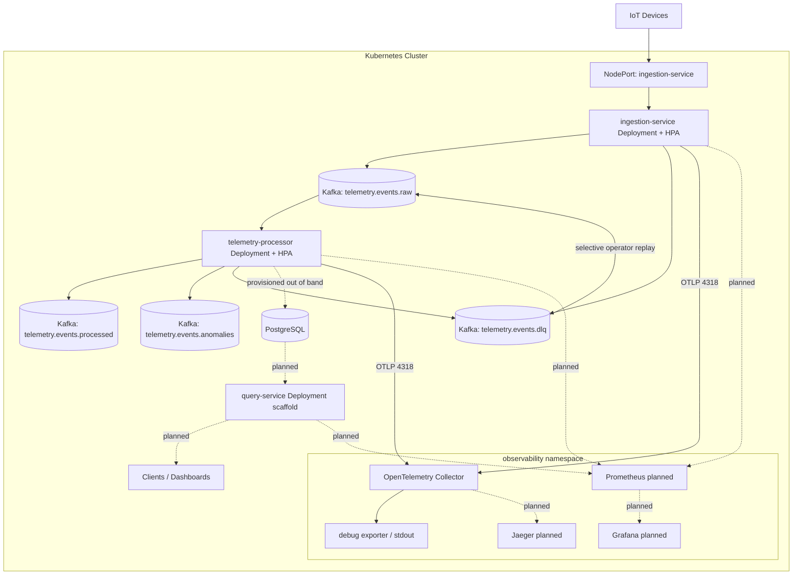

# Kubernetes Deployment Diagram

This diagram shows how PulseStream is deployed inside a Kubernetes cluster. The manifests are committed under [`infrastructure/kubernetes/`](../../infrastructure/kubernetes/) and have been applied against a live cluster.

Solid edges are implemented. Dashed edges are planned or provisioned out of band. Status words follow [`PROJECT_STATE.md`](../../PROJECT_STATE.md#how-to-read-status-in-this-repository).

```mermaid
flowchart TB
    U[IoT Devices] --> I[NodePort: ingestion-service]

    subgraph Kubernetes Cluster
        I --> S1[ingestion-service Deployment + HPA]
        S1 --> K1[(Kafka: telemetry.events.raw)]

        K1 --> S2[telemetry-processor Deployment + HPA]
        S2 --> K2[(Kafka: telemetry.events.processed)]
        S2 --> K3[(Kafka: telemetry.events.anomalies)]

        S1 --> K4[(Kafka: telemetry.events.dlq)]
        S2 --> K4
        K4 -->|selective operator replay| K1

        S2 -. provisioned out of band .-> DB[(PostgreSQL)]

        DB -. planned .-> S3[query-service Deployment scaffold]
        S3 -. planned .-> C[Clients / Dashboards]

        subgraph observability namespace
            O[OpenTelemetry Collector]
            DBG[debug exporter / stdout]
            P[Prometheus planned]
            G[Grafana planned]
            J[Jaeger planned]
        end

        S1 -->|OTLP 4318| O
        S2 -->|OTLP 4318| O
        O --> DBG
        O -. planned .-> J
        S1 -. planned .-> P
        S2 -. planned .-> P
        S3 -. planned .-> P
        P -. planned .-> G
    end
```

## What is deployed

| Component | Manifests | Status |
| :--- | :--- | :--- |
| `ingestion-service` Deployment, ConfigMap, ClusterIP Service, NodePort Service, HPA | [`ingestion-service/`](../../infrastructure/kubernetes/ingestion-service/) | Validated on a live cluster |
| `telemetry-processor` Deployment, ConfigMap, Service, HPA | [`telemetry-processor/`](../../infrastructure/kubernetes/telemetry-processor/) | Validated on a live cluster |
| `query-service` Deployment, ConfigMap, Service | [`query-service/`](../../infrastructure/kubernetes/query-service/) | Deployed; the application itself is a scaffold |
| Kafka via the Strimzi operator, KRaft mode, persistent storage, declarative topics | [`kafka/`](../../infrastructure/kubernetes/kafka/) | Validated on a live cluster |
| Default-deny NetworkPolicies per service | [`network-policies/`](../../infrastructure/kubernetes/network-policies/) | Validated on a live cluster |
| Custom-metrics autoscaling via the Prometheus adapter | [`autoscaling/`](../../infrastructure/kubernetes/autoscaling/) | Implemented; behaviour under load not yet validated ([#153](https://github.com/ME-Massine/pulsestream/issues/153)) |
| OpenTelemetry Collector in the `observability` namespace | [`observability/`](../../infrastructure/kubernetes/observability/) | Validated on a live cluster |

## What is not deployed

*   **PostgreSQL.** No manifest is committed. The service ConfigMaps address `postgres:5432`, so that Service must be provisioned out of band before the persistence path works in-cluster.
*   **A trace backend.** The collector accepts spans and terminates them in its `debug` exporter, which writes one line per exported batch to stdout. Aiming an `otlp` exporter at a Service that does not exist would leave the collector retrying and queueing every batch it accepts. When the backend lands ([#158](https://github.com/ME-Massine/pulsestream/issues/158)), the change is confined to the collector ConfigMap.
*   **Prometheus and Grafana** ([#154](https://github.com/ME-Massine/pulsestream/issues/154), [#155](https://github.com/ME-Massine/pulsestream/issues/155), [#156](https://github.com/ME-Massine/pulsestream/issues/156)). The services expose `/actuator/prometheus`, but nothing scrapes them in the cluster.
*   **An Ingress or API gateway.** External telemetry enters through a NodePort Service, without TLS or authentication ([#273](https://github.com/ME-Massine/pulsestream/issues/273)).

## Notes

*   `query-service` is not connected to the collector. It has no `otel` configuration and emits no spans, so it gets no OTLP endpoint and no matching egress rule — the NetworkPolicy validator asserts that absence rather than leaving it to the manifest.
*   `telemetry-processor` scales to at most 3 replicas: `telemetry.events.raw` has 3 partitions and consumer concurrency defaults to 1, so a fourth replica would receive no partition assignment. See [`../architecture/autoscaling-strategy.md`](../architecture/autoscaling-strategy.md).
*   Each manifest directory carries its own `README.md` with apply order, prerequisites, and verification steps. Do not apply the tree wholesale — some directories contain example Secrets that must not be applied.
