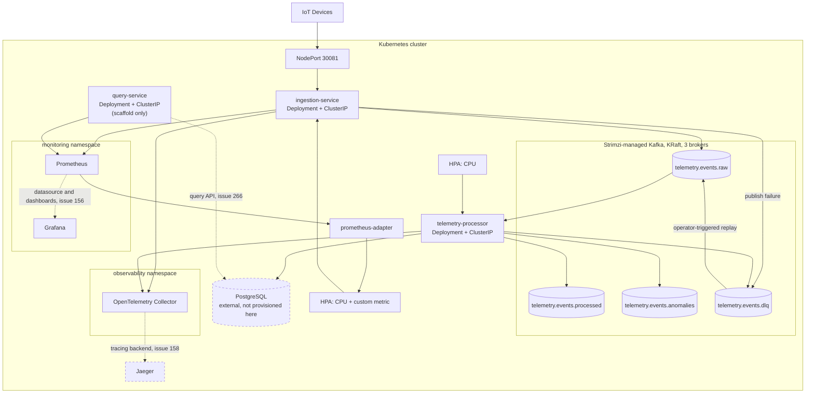

# Kubernetes Deployment Diagram

This diagram shows how PulseStream is deployed inside a Kubernetes cluster. The manifests are in [`infrastructure/kubernetes/`](../../infrastructure/kubernetes/); most component directories carry a README with apply and verification steps.

Solid boxes and edges are backed by manifests in this repository. Dashed boxes are prerequisites the platform expects but does not provision, and dotted edges are planned work.

```mermaid
flowchart TB
    U[IoT Devices] --> NP[NodePort 30081]

    subgraph cluster["Kubernetes cluster"]
        NP --> S1["ingestion-service<br/>Deployment + ClusterIP"]
        S3["query-service<br/>Deployment + ClusterIP<br/>(scaffold only)"]

        subgraph kafkans["Strimzi-managed Kafka, KRaft, 3 brokers"]
            K1[(telemetry.events.raw)]
            K2[(telemetry.events.processed)]
            K3[(telemetry.events.anomalies)]
            K4[(telemetry.events.dlq)]
        end

        S1 --> K1
        S1 -- publish failure --> K4
        K1 --> S2["telemetry-processor<br/>Deployment + ClusterIP"]
        S2 --> K2
        S2 --> K3
        S2 --> K4
        K4 -- operator-triggered replay --> K1

        S2 --> DB[("PostgreSQL<br/>external, not provisioned here")]
        S3 -. query API, issue 266 .-> DB

        H1["HPA: CPU + custom metric"] --> S1
        H2["HPA: CPU"] --> S2

        subgraph monitoring["monitoring namespace"]
            P[Prometheus]
            G[Grafana]
        end

        subgraph obs["observability namespace"]
            O[OpenTelemetry Collector]
        end

        S1 --> P
        S3 --> P
        P --> PA[prometheus-adapter]
        PA --> H1
        S1 --> O
        S2 --> O
        P -. datasource and dashboards, issue 156 .-> G
        O -. tracing backend, issue 158 .-> J[Jaeger]
    end

    style DB stroke-dasharray: 5 5
    style J stroke-dasharray: 5 5
```

**Deployed components:**

*   **Services.** `ingestion-service`, `telemetry-processor` and `query-service` each have a Deployment with resource requests and limits, liveness and readiness probes against the `/livez` and `/readyz` paths, and configuration externalized into a ConfigMap. Processor database credentials come from a Secret (`secret.example.yaml` is the template; the Secret itself is not committed).
*   **Kafka.** Deployed with the Strimzi operator in KRaft mode across three brokers with persistent storage, and the four platform topics declared as `KafkaTopic` resources at replication factor 3 with `min.insync.replicas=2`. See [ADR 0005](../decisions/0005-kafka-on-kubernetes-with-strimzi.md).
*   **Networking.** Internal traffic goes through ClusterIP services using the DNS conventions in [service-discovery.md](../../infrastructure/kubernetes/service-discovery.md). External telemetry enters through a NodePort on 30081, which serves plain HTTP — TLS termination, authentication and rate limiting are the ingress concerns tracked by #273. NetworkPolicies isolate each service.
*   **Autoscaling.** CPU-based HPAs for `ingestion-service` and `telemetry-processor`, plus a custom-metrics HPA for `ingestion-service` driven by `prometheus-adapter` reading a request-rate metric from Prometheus. Scale-up and scale-down behaviour was validated end-to-end; see [autoscaling-validation.md](../architecture/autoscaling-validation.md).
*   **Observability.** An OpenTelemetry Collector in the `observability` namespace; Prometheus (installed from a chart with version-controlled values) and a base Grafana deployment in the `monitoring` namespace. Prometheus discovers pods by role and scrapes `ingestion-service` and `query-service`.

**Limitations:**

*   **PostgreSQL is not provisioned in cluster.** The processor's ConfigMap points at a `postgres` Service that must exist beforehand; no manifest in this repository creates it.
*   **`telemetry-processor` is not scraped.** Its actuator surface, including the state-changing `dlqreplay` endpoint, is bound to loopback on a separate management port, so `/actuator/prometheus` is not reachable over the pod network. Exposing it is a security and isolation change, not a scrape-config change.
*   **In-cluster Grafana has no datasource or dashboards yet** (#156), **there is no tracing backend in the cluster** (#158), and **the observability stack has not been validated end-to-end in a cluster** (#159). Jaeger currently exists only in the local Compose stack.
