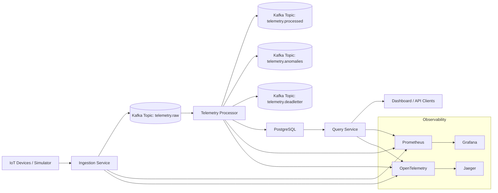

# System Architecture Diagram

This diagram shows the high-level architecture of PulseStream and the main interactions between its components.

**Notes:**

*   `telemetry.raw` stores incoming telemetry readings.

*   `telemetry.processed` stores normalized or enriched downstream events.

*   `telemetry.anomalies` captures anomaly detection results.

*   `telemetry.deadletter` stores invalid or failed events.
