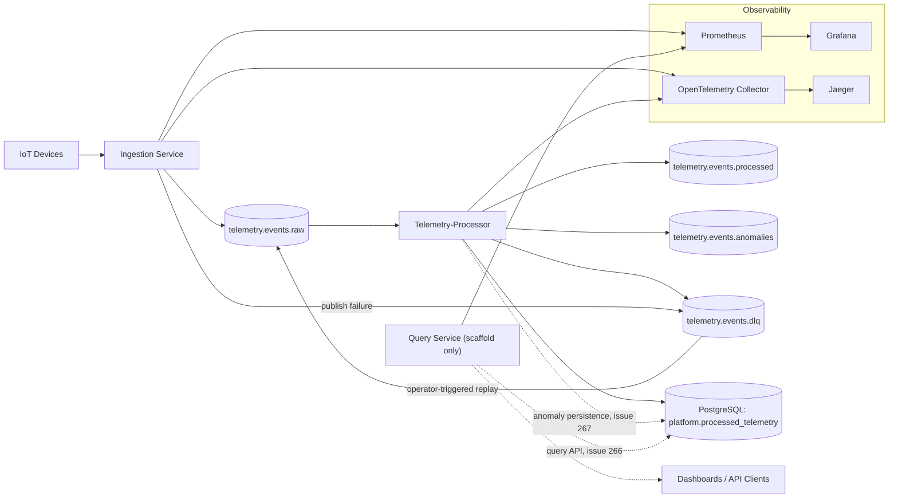

# System Architecture Diagram

This diagram shows the high-level architecture of PulseStream and the main interactions between its components.

Solid edges are implemented. Dotted edges are planned and are labelled with the issue that tracks them. [PROJECT_STATE.md](../../PROJECT_STATE.md) is the authoritative source for the status of anything shown here.

```mermaid
flowchart LR
    A[IoT Devices] --> B[Ingestion Service]
    B --> T1[(telemetry.events.raw)]

    T1 --> C[Telemetry-Processor]
    C --> T2[(telemetry.events.processed)]
    C --> T3[(telemetry.events.anomalies)]
    C --> T4[(telemetry.events.dlq)]
    B -- publish failure --> T4
    T4 -- operator-triggered replay --> T1

    C --> D[(PostgreSQL: platform.processed_telemetry)]
    C -. anomaly persistence, issue 267 .-> D

    E["Query Service (scaffold only)"] -. query API, issue 266 .-> D
    E -.-> F[Dashboards / API Clients]

    subgraph Observability
        P[Prometheus]
        G[Grafana]
        O[OpenTelemetry Collector]
        J[Jaeger]
    end

    B --> P
    E --> P
    B --> O
    C --> O
    P --> G
    O --> J
```

**Topics:**

*   `telemetry.events.raw` — telemetry accepted by the ingestion service, and the target of DLQ replay.
*   `telemetry.events.processed` — normalized telemetry published by the processor. No consumer reads this topic yet.
*   `telemetry.events.anomalies` — detected anomalies. No consumer reads this topic yet. The two outcomes are exclusive: an anomalous reading goes here only, and is not persisted or republished as processed telemetry.
*   `telemetry.events.dlq` — failed events, written by **both** services: by `ingestion-service` when publishing an accepted event fails, and by `telemetry-processor` when processing throws. Records carry error metadata and a `sourceService` field.

**Notes:**

*   Dead-letter replay is manual, selective and bounded: an operator supplies the `eventId` values to replay through the `dlqreplay` actuator endpoint, and the run stops at per-partition end offsets snapshotted at trigger time. See [event-replay-strategy.md](../architecture/event-replay-strategy.md).
*   `telemetry-processor` is not a Prometheus scrape target. Its actuator surface — which includes the state-changing `dlqreplay` endpoint — is served on a separate management port bound to loopback.
*   The `query-service` box is a Spring Boot scaffold: it runs, exposes actuator endpoints and is scraped, but has no REST endpoints and no database access.
*   Traces currently cover the HTTP hop into ingestion. The Kafka producer path is not instrumented (#294), so a trace does not yet continue into the processor.
