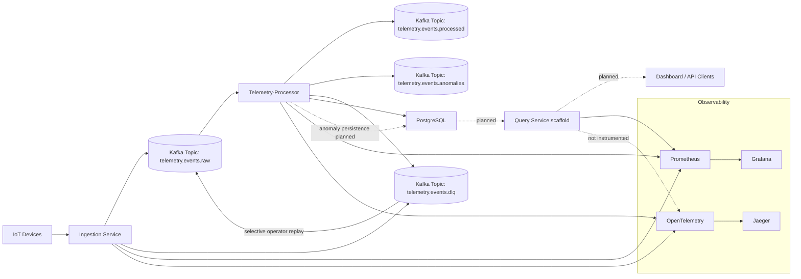

# System Architecture Diagram

This diagram shows the high-level architecture of PulseStream and the main interactions between its components.

Solid edges are implemented. Dashed edges are planned. Status words follow [`PROJECT_STATE.md`](../../PROJECT_STATE.md#how-to-read-status-in-this-repository).

```mermaid
flowchart LR
    A[IoT Devices] --> B[Ingestion Service]
    B --> T1[(Kafka Topic: telemetry.events.raw)]

    T1 --> C[Telemetry-Processor]
    C --> T2[(Kafka Topic: telemetry.events.processed)]
    C --> T3[(Kafka Topic: telemetry.events.anomalies)]

    B --> T4[(Kafka Topic: telemetry.events.dlq)]
    C --> T4
    T4 -->|selective operator replay| T1

    C --> D[PostgreSQL]
    C -. anomaly persistence planned .-> D
    D -. planned .-> E[Query Service scaffold]
    E -. planned .-> F[Dashboard / API Clients]

    subgraph Observability
        P[Prometheus]
        G[Grafana]
        O[OpenTelemetry]
        J[Jaeger]
    end

    B --> P
    C --> P
    E --> P

    B --> O
    C --> O
    E -. not instrumented .-> O

    P --> G
    O --> J
```

**Topics:**

*   `telemetry.events.raw` — incoming telemetry readings, produced by the ingestion service and consumed by the processor.

*   `telemetry.events.processed` — normalized downstream events. It has no committed consumer today; `query-service` is its planned consumer.

*   `telemetry.events.anomalies` — anomaly detection results. It has no committed consumer today.

*   `telemetry.events.dlq` — failed events. Produced by the ingestion service when a publish to `raw` fails, and by the processor when processing fails. Consumed by the processor's replay listener, which republishes operator-selected events back to `raw`.

**Notes:**

*   **Dead-letter routing and replay are implemented and validated under Docker Compose.** Replay is bounded and selective — see [`../architecture/event-replay-strategy.md`](../architecture/event-replay-strategy.md).

*   **Tracing is implemented.** `ingestion-service` and `telemetry-processor` export OTLP over `http/protobuf` — to Jaeger under Docker Compose, and to an OpenTelemetry Collector on Kubernetes, where traces currently terminate in the collector's `debug` exporter.

*   `query-service` is a **scaffold**: it exposes actuator and Prometheus endpoints but serves no query endpoints, reads nothing from PostgreSQL, and emits no spans.

*   Only normal processed telemetry is written to PostgreSQL. Anomaly rows are not persisted by application code.
