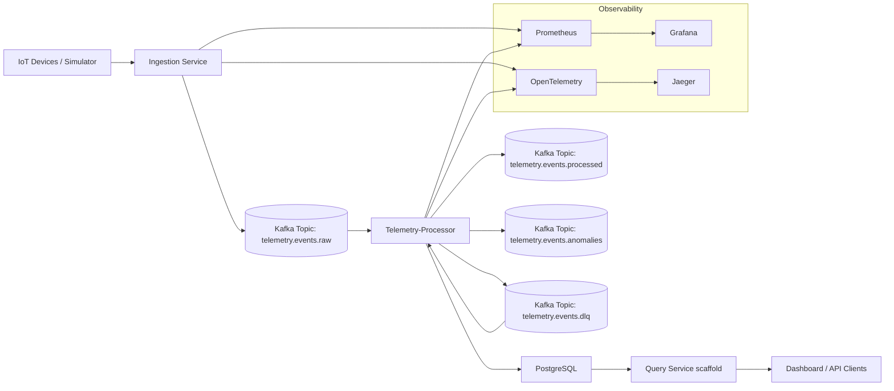

# System Architecture Diagram

This diagram shows the high-level architecture of PulseStream and the main interactions between its components.

```mermaid
flowchart LR
    A[IoT Devices / Simulator] --> B[Ingestion Service]
    B --> T1[(Kafka Topic: telemetry.events.raw)]

    T1 --> C[Telemetry-Processor]
    C --> T2[(Kafka Topic: telemetry.events.processed )]
    C --> T3[(Kafka Topic: telemetry.events.anomalies)]
    C --> T4[(Kafka Topic: telemetry.events.dlq)]

    T4 --> C

    C --> D[PostgreSQL]
    D --> E[Query Service scaffold]
    E --> F[Dashboard / API Clients]

    subgraph Observability
        P[Prometheus]
        G[Grafana]
        O[OpenTelemetry]
        J[Jaeger]
    end

    B --> P
    C --> P

    B --> O
    C --> O

    P --> G
    O --> J
```

**Notes:**

*   `telemetry.events.raw` stores incoming telemetry readings.

*   `telemetry.events.processed` stores normalized or enriched downstream events.

*   `telemetry.events.anomalies` captures anomaly detection results.

*   `telemetry.events.dlq` stores failed events; the telemetry processor can replay them back into the pipeline via a management endpoint.

*   The `query-service` exists as a deployable scaffold; its REST query APIs are Phase 7 work.

*   OpenTelemetry instrumentation exports OTLP traces to Jaeger (local) or an OpenTelemetry Collector (Kubernetes).
