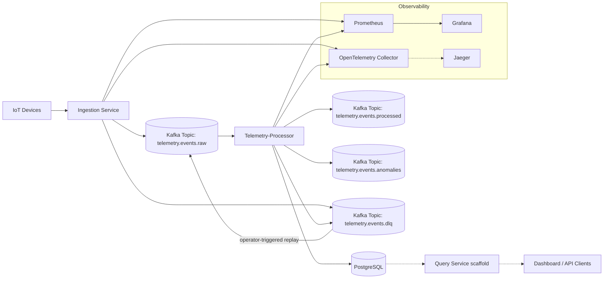

# System Architecture Diagram

This diagram shows the high-level architecture of PulseStream and the main interactions between its components.

Solid edges are implemented paths. Dashed edges are not in place yet; each is called out under **Not yet connected** below. See [`PROJECT_STATE.md`](../../PROJECT_STATE.md) for the authoritative status of every component.

```mermaid
flowchart LR
    A[IoT Devices] --> B[Ingestion Service]
    B --> T1[(Kafka Topic: telemetry.events.raw)]

    T1 --> C[Telemetry-Processor]
    C --> T2[(Kafka Topic: telemetry.events.processed)]
    C --> T3[(Kafka Topic: telemetry.events.anomalies)]

    B --> T4[(Kafka Topic: telemetry.events.dlq)]
    C --> T4
    T4 -->|operator-triggered replay| T1

    C --> D[(PostgreSQL)]
    D -.-> E[Query Service scaffold]
    E -.-> F[Dashboard / API Clients]

    subgraph Observability
        P[Prometheus]
        G[Grafana]
        O[OpenTelemetry Collector]
        J[Jaeger]
    end

    B --> P
    C --> P

    B --> O
    C --> O

    P --> G
    O -.-> J
```

**Notes:**

*   `telemetry.events.raw` carries incoming telemetry readings from the ingestion service.
*   `telemetry.events.processed` carries normalized downstream events.
*   `telemetry.events.anomalies` carries anomaly detection results.
*   `telemetry.events.dlq` receives failed events from **both** services. `ingestion-service` writes an accepted event whose raw-topic publish failed; `telemetry-processor` writes on first processing failure. Records are republished to `telemetry.events.raw` only when an operator selects them by `eventId` — see [event-replay-strategy.md](../architecture/event-replay-strategy.md).
*   Both event-path services scrape-expose Prometheus metrics and export OTLP traces.

**Not yet connected:**

*   `query-service` is a scaffold — no endpoints, no data access, no datasource ([#266](https://github.com/ME-Massine/pulsestream/issues/266)).
*   Anomaly events reach Kafka but are not persisted to PostgreSQL ([#267](https://github.com/ME-Massine/pulsestream/issues/267)).
*   The collector forwards to Jaeger under Docker Compose. In Kubernetes it terminates in a `debug` exporter until a tracing backend is deployed ([#158](https://github.com/ME-Massine/pulsestream/issues/158)).
